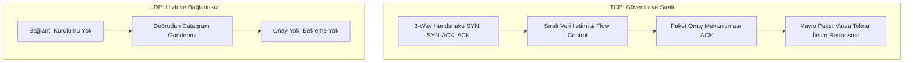
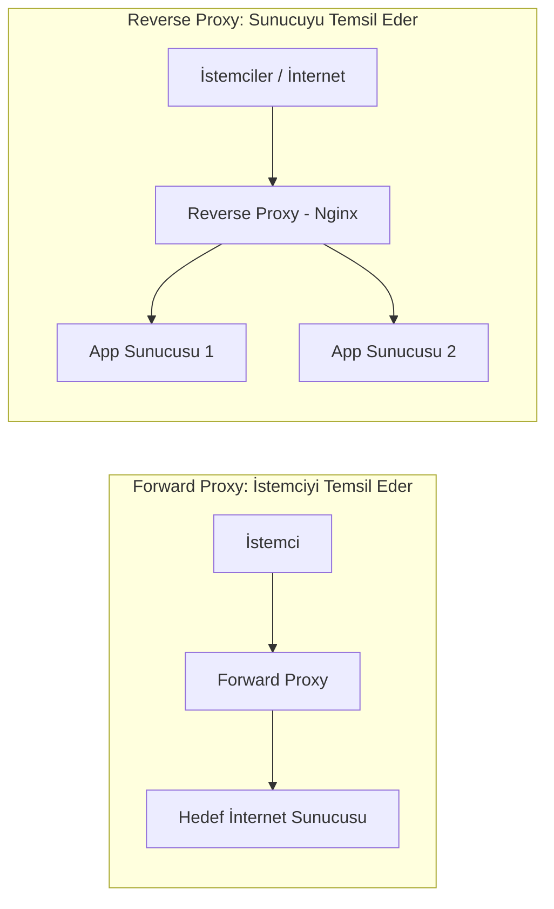

# 🌐 Kapsamlı Ağ Yapıları, Protokoller ve Mimari Rehberi

Bu rehber; bilgisayar ağlarının temel adresleme mekanizmalarından güvenlik protokollerine, yönlendirmeden modern dağıtık sistem mimarilerine kadar uzanan kavramları **teorik temeller**, **teknik parametreler**, **günlük hayat analojileri** ve **sektörel kullanım senaryoları** ile ele almaktadır.

---

## 📑 İçindekiler

- [Özet Referans Tablosu (Hızlı Bakış)](#-özet-referans-tablosu-hızlı-bakış)
- [Modül 1: Ağın Kimlik ve Adresleme Temelleri](#-modül-1-ağın-kimlik-ve-adresleme-temelleri)
  - [1. MAC Adresi (Media Access Control)](#1-mac-adresi-media-access-control)
  - [2. IP Adresi (IPv4 & IPv6)](#2-ip-adresi-ipv4--ipv6)
  - [3. Subnet Mask (Alt Ağ Maskesi) & CIDR](#3-subnet-mask-alt-ağ-maskesi--cidr)
  - [4. Default Gateway (Varsayılan Ağ Geçidi)](#4-default-gateway-varsayılan-ağ-geçidi)
- [Modül 2: Dinamik Yapılandırma ve Çözümleme Protokolleri](#-modül-2-dinamik-yapılandırma-ve-çözümleme-protokolleri)
  - [5. ARP (Address Resolution Protocol)](#5-arp-address-resolution-protocol)
  - [6. DHCP (Dynamic Host Configuration Protocol)](#6-dhcp-dynamic-host-configuration-protocol)
  - [7. DNS (Domain Name System)](#7-dns-domain-name-system)
- [Modül 3: Taşıma Katmanı, Portlar ve İletim Mekanizmaları](#-modül-3-taşıma-katmanı-portlar-ve-iletim-mekanizmaları)
  - [8. TCP & UDP Karşılaştırması](#8-tcp--udp)
  - [9. Portlar ve Sockets](#9-portlar-ve-sockets)
- [Modül 4: Yönlendirme, İzolasyon ve Ağ Çevirisi](#-modül-4-yönlendirme-izolasyon-ve-ağ-çevirisi)
  - [10. NAT (Network Address Translation)](#10-nat-network-address-translation)
  - [11. VLAN (Virtual Local Area Network) & Trunking](#11-vlan-virtual-local-area-network--trunking)
- [Modül 5: Güvenlik, Tünelleme ve Yönlendirme Servisleri](#-modül-5-güvenlik-tünelleme-ve-yönlendirme-servisleri)
  - [12. Firewall (Güvenlik Duvarı)](#12-firewall-güvenlik-duvarı)
  - [13. VPN (Virtual Private Network)](#13-vpn-virtual-private-network)
  - [14. Proxy (Vekil Sunucu: Forward vs Reverse)](#14-proxy-vekil-sunucu)
- [Modül 6: Bütünleşik Uygulama Senaryosu (Uçtan Uca Örnek)](#-modül-6-bütünleşik-uygulama-senaryosu-uçtan-uca-örnek)

---

## 📊 Özet Referans Tablosu (Hızlı Bakış)

| Protokol / Kavram | OSI Katmanı | Adresleme / Biçim | Temel Görevi |
| :--- | :--- | :--- | :--- |
| **MAC** | Katman 2 (Data Link) | 48-bit Hex (`52:54:00:...`) | Yerel ağdaki fiziksel kart kimliği |
| **IP (IPv4/IPv6)** | Katman 3 (Network) | 32-bit Dot / 128-bit Hex | Ağlar arası mantıksal yönlendirme |
| **Subnet Mask & CIDR** | Katman 3 (Network) | `/24`, `255.255.255.0` | Ağ kimliği (Network) ile Cihazı (Host) ayırma |
| **Default Gateway** | Katman 3 (Network) | Yerel Router IP'si | Bilinmeyen hedefler için çıkış kapısı |
| **ARP** | Katman 2.5 / 2-3 Arası | IP $\leftrightarrow$ MAC Eşlemesi | IP adresinden donanım adresini bulma |
| **DHCP** | Katman 7 (Uygulama - UDP 67/68) | Otomatik IP/Konfigürasyon | Cihazlara dinamik ağ parametreleri atama |
| **DNS** | Katman 7 (Uygulama - UDP/TCP 53) | FQDN $\leftrightarrow$ IP Eşlemesi | Alan adlarını IP adreslerine çevirme |
| **TCP** | Katman 4 (Transport) | 3-Way Handshake, Segment | Güvenilir, sıralı, kayıpsız veri iletimi |
| **UDP** | Katman 4 (Transport) | Datagram, Bağlantısız | Hızlı, düşük gecikmeli, teyitsiz iletim |
| **Port & Socket** | Katman 4 (Transport) | 16-bit (`0-65535`) / `IP:Port` | Cihaz üzerindeki spesifik uygulamayı ayırma |
| **NAT (SNAT/DNAT)** | Katman 3 / 4 (Network/Transport) | IP & Port Çevirisi | Yerel IP'leri internete çıkarma ve port yönlendirme |
| **VLAN (802.1Q)** | Katman 2 (Data Link) | 12-bit VLAN Tag (1-4094) | Fiziksel switch'i mantıksal alt ağlara bölme |
| **Firewall** | Katman 3, 4, 7 (NGFW) | Stateful Denetim / ACL | Kurallara göre ağ trafiğini filtreleme |
| **VPN** | Katman 3 / Katman 4 Tünel | IPsec, WireGuard, OpenVPN | Güvensiz ağ üzerinden şifreli tünel kurma |
| **Proxy** | Katman 7 (Uygulama) | Forward / Reverse Proxy | İstemci veya sunucu adına vekillik yapma |

---

## 🧱 Modül 1: Ağın Kimlik ve Adresleme Temelleri

### 1. MAC Adresi (Media Access Control)

* **Nedir:** Ağ Arayüz Kartının (NIC) üretici tarafından donanıma kazınmış fiziksel ve benzersiz 48-bit (6 oktet) kimliğidir.  
  * *Format Örneği:* `52:54:00:12:34:56` (İlk 3 oktet `OUI` üretici kodu, son 3 oktet benzersiz cihaz seri no'sudur).
* **Kullanım Amacı:** OSI 2. Katmanda (Data Link) aynı yerel ağ (LAN) içindeki switch'lerin paketleri hedef cihazın portuna doğru anahtarlaması (switching) için kullanılır.
  * *Basit PC Örneği:* Aynı switch'e kabloyla bağlı 3 bilgisayar düşünelim:
    * **PC-1 (Port 1'e takılı):** MAC: `AA:AA:AA:AA:AA:AA`
    * **PC-2 (Port 2'ye takılı):** MAC: `BB:BB:BB:BB:BB:BB`
    * **PC-3 (Port 3'e takılı):** MAC: `CC:CC:CC:CC:CC:CC`

    PC-1, PC-2'ye yerel ağdan bir dosya göndermek istediğinde, paketin Ethernet çerçevesindeki "Hedef MAC" kısmına PC-2'nin adresi olan `BB:BB:BB:BB:BB:BB` yazılır. Paket switch'e ulaştığında switch kendi hafızasındaki **MAC Tablosuna (CAM Table)** bakar ve bu adresin **Port 2**'de olduğunu görür. Paketi gereksiz yere PC-3'e göndermez; **doğrudan ve yalnızca Port 2'ye iletir**. Böylece ağ trafiği boğulmaz ve güvenli bir iletim sağlanır.
* **Ayar, Değiştirme & Sabitleme Mekanizmaları:**
  * **İşletim Sistemi Seviyesinde Geçici Değiştirme (MAC Spoofing):**  
    Fiziksel donanımdaki kalıcı fabrika çıkış adresine (BIA - *Burned-in Address*) dokunulmaz; işletim sistemi çekirdeğindeki sanal ağ yığınında geçici olarak ezilir (override):
    ```bash
    # Mevcut MAC adresini ve arayüz durumunu görüntüleme
    ip link show eth0

    # Arayüzü durdur, adresi değiştir ve tekrar ayağa kaldır (MAC Spoofing)
    sudo ip link set dev eth0 down
    sudo ip link set dev eth0 address 00:11:22:33:44:55
    sudo ip link set dev eth0 up
    ```
  * **Sanal Makinelerde (KVM/libvirt/VMware) MAC Sabitleme ve Değiştirme:**  
    Sanal makinelerde gerçek bir fiziksel ağ kartı yoktur; hipervizör (hypervisor) işletim sistemine sanal bir kart (**vNIC**) emüle eder. Eğer sanal makine oluşturulurken MAC elle atanmazsa, hipervizör rastgele bir MAC adresi türetir. Klonlanan veya yeniden oluşturulan sanal makinelerin her seferinde aynı kimliğe sahip olması için XML yapılandırma dosyasında MAC **sabitlenir**.
    
    *KVM/libvirt XML Örneği (`virsh edit <vm_adi>`):*
    ```xml
    <devices>
      <interface type='network'>
        <!-- Sanal makinenin sabit donanımsal kimliği -->
        <mac address='52:54:00:1a:2b:3c'/>
        <source network='default'/>
        <model type='virtio'/>
      </interface>
    </devices>
    ```
    > 🏷️ **Hipervizör OUI Standartları:** Sanal makineler üretilirken çakışmaları önlemek için özel üretici önekleri kullanılır:
    > - **KVM / QEMU:** `52:54:00:xx:xx:xx`
    > - **VMware ESXi/Workstation:** `00:50:56:xx:xx:xx` veya `00:0c:29:xx:xx:xx`
    > - **Oracle VirtualBox:** `08:00:27:xx:xx:xx`

  * **MAC Adresi ile DHCP Rezervasyonu Nasıl Güvenceye Alınır? (Sıfırdan Mantık Zinciri):**
    > ℹ️ *Ön Bilgi: Ağlarda cihazlara otomatik IP adresi dağıtan merkezi bir yazılım/cihaz bulunur (Buna **DHCP Sunucusu** denir; evlerde bu görevi modem yapar. Detayları [Modül 2 / Madde 6'da](#6-dhcp-dynamic-host-configuration-protocol) göreceğiz).*

    1. **Sanal Makine Açılır ve İstek Gönderir:**  
       Yeni kurulan sanal makine ilk kez açıldığında henüz bir IP adresine sahip değildir. Ancak yukarıdaki XML tanımı sayesinde **`52:54:00:1a:2b:3c` şeklinde sabit bir donanım (MAC) kimliği** vardır. Sanal makine ağa bir paket fırlatır:  
       > *"Ben `52:54:00:1a:2b:3c` MAC adresine sahip bir makineyim, ağda iletişim kurabilmem için bana bir IP adresi verin!"*
    
    2. **DHCP Sunucusu İsteği Yakalar ve Eşleştirir:**  
       Ağdaki modem/DHCP sunucusu bu çağrıyı duyar. Normal şartlarda DHCP sunucusu boşta duran rastgele bir IP atar (ve bu IP ileride değişebilir). Ancak bir sunucunun IP'sinin sürekli değişmesi felakettir. Bu yüzden ağ yöneticisi DHCP sunucusunun yönetim paneline önceden şu kuralı yazar (**Rezervasyon / Static Lease**):  
       ```text
       Kural: "Eğer IP isteyen cihazın MAC adresi 52:54:00:1a:2b:3c ise -> Rastgele IP verme, HER ZAMAN 192.168.1.100 IP'sini teslim et!"
       ```
    
    3. **Büyük Avantajı:**  
       Sanal sunucunun işletim sistemi içine girip elle statik IP yapılandırması (`netplan`, `ifcfg` vb.) yapmakla uğraşmazsınız. Sanal makineyi silseniz, formatlasanız veya yeniden kursanız dahi; XML şablonunda MAC adresi sabit olduğu sürece açılır açılmaz DHCP'den aynı rezerve IP'yi (`192.168.1.100`) çeker. Böylece web veya veritabanı sunucunuzun IP'si hiçbir zaman kaybolmaz; güvenlik duvarı ve alan adı yönlendirmeleriniz asla bozulmaz.
* **Gündelik Hayatta Karşılığı:**  
  > 💡 **Analoji:** Bir insanın **T.C. Kimlik Numarası** gibidir; kişi nereye taşınırsa taşınsın bu kimlik sabittir. Evdeki Wi-Fi modeminizde *"MAC Filtreleme"* açarak sadece evdeki cihazların MAC adreslerine izin vermek ve komşunuz şifreyi bilse dahi ağa girmesini engellemek en tipik örneğidir.
* **Alternatif Kullanım Amaçları ve Örnekleri:**
  * **Otel / Havaalanı Wi-Fi Süre Sıfırlama (MAC Spoofing):** Havalimanlarındaki 30 dakikalık ücretsiz internet kotaları genelde cihazın MAC adresini veritabanına kaydederek takip eder. Kullanıcılar `macchanger -r wlan0` komutuyla ağ kartının MAC adresini rastgele değiştirip yeni bir cihaz gibi görünerek kotayı sıfırlayabilir.
  * **Wake-on-LAN (WoL):** Bilgisayar tamamen kapalıyken bile ağ kartına hedef MAC adresini içeren 102 baytlık özel bir *"Magic Packet"* (`FF:FF:FF:FF:FF:FF` + 16 kez hedef MAC) gönderilerek cihaz uzaktan uyandırılır.

---

### 2. IP Adresi (IPv4 & IPv6)

* **Nedir:** Cihazların ağlar üzerinde mantıksal olarak konumlanmasını sağlayan, yönlendirilebilir 32-bit (IPv4) veya 128-bit (IPv6) adresleme protokolüdür.
* **Kullanım Amacı:** OSI 3. Katmanda (Network) paketlerin farklı yerel ağlar ve internet omurgası üzerinden hedefe yönlendirilmesini (Routing) sağlar.
* **IPv4 vs IPv6 (Neden Yeni Protokole Geçiyoruz?):**
  * **IPv4 (32-bit):** Yaklaşık $2^{32} \approx 4.3$ milyar adres üretir. 2010'lu yıllarda dünyadaki tüm IPv4 adresleri tükenmiştir. Bu açığı kapatabilmek için **NAT (Network Address Translation)** tekniği geliştirilmiştir.
    > ℹ️ *NAT Nedir? Evinizdeki onlarca telefon ve bilgisayarın modem arkasına gizlenerek internete **tek bir ortak IP** üzerinden çıkmasını sağlayan adres çeviricisidir (Detayları [Modül 4 / Madde 10'da](#10-nat-network-address-translation) incelenecektir).*
  * **IPv6 (128-bit):** Yaklaşık $2^{128} \approx 3.4 \times 10^{38}$ (trilyonlarca trilyon) adres üretir. Dünyadaki her kum tanesine binlerce IP verilebilecek büyüklüktedir. 
    * **NAT Zorunluluğunu Kaldırır:** Her cihaz doğrudan genel internette uçtan uca (*End-to-End*) benzersiz bir küresel IP alabilir.
    * **Dahili Güvenlik:** Veri şifreleme standardı olan **IPsec** doğrudan protokolün içine gömülüdür.
    * **Otomatik Yapılandırma (SLAAC):** Cihazlar ağa takıldığında bir DHCP sunucusuna dahi ihtiyaç duymadan kendi IP adreslerini otomatik olarak türetebilir (*Stateless Address Autoconfiguration*).
* **Temel IP Blokları ve Sınıflandırma:**
  * **Public IP (Genel):** İnternette yönlendirilebilen, ICANN/RIPE gibi uluslararası kurumlar tarafından ISP'lere ve şirketlere tahsis edilen küresel IP'lerdir.
  * **Private IP (Özel - RFC 1918):** İnternete doğrudan çıkamayan, ev ve şirket içi yerel ağlara ayrılmış bloklardır (*RFC: İnternet standartlarını belirleyen resmi teknik şartnamelerdir*):
    * `10.0.0.0/8` (Büyük kurumsal yapılar ve veri merkezleri)
    * `172.16.0.0/12` (Orta ölçekli ağlar / Docker container ağları)
    * `192.168.0.0/16` (Ev ve küçük ofis ağları)
  * **Loopback IP (`127.0.0.1` / `::1`):** Cihazın kendi yerel TCP/IP yığınını test eden ve dışarıya paket çıkarmadan yerel servislere bağlanmayı sağlayan adrestir.
  * **APIPA (`169.254.0.0/16`):** DHCP sunucusundan yanıt alınamadığında işletim sisteminin cihaza otomatik atadığı geçici yerel iletişim bloğudur. Bu IP'yi gören bir kullanıcı hemen *"Ağda DHCP sunucusuna ulaşılamıyor"* teşhisini koymalıdır.
* **Gündelik Hayatta Karşılığı:**  
  > 💡 **Analoji:** MAC kimlik kartıysa, IP adresi **evinizin posta adresidir**. Şehir veya sokak değiştirdiğinizde (başka kafeye veya ağa bağlandığınızda) posta adresiniz değişir. Evdeki akıllı ampulün telefon uygulaması üzerinden açılıp kapanması yerel IP (`192.168.1.45`) üzerinden yürür.
* **Alternatif Kullanım Amaçları ve Örnekleri:**
  * **Coğrafi Engellemeler ve Hak Yönetimi:** Netflix, Steam vb. servisler kullanıcının Public IP adresine bakarak (GeoIP) bulunduğu ülkeyi belirler, telif haklarına göre içerik kütüphanesini ve fiyatlandırmayı sınırlar.
  * **Anycast IP Dağıtımı:** Tek bir IP adresi (örn. Cloudflare `1.1.1.1` veya Google `8.8.8.8`) dünyanın 200'den fazla farklı veri merkezinde aynı anda anons edilir (*BGP: İnternet omurgasındaki ISP'lerin yönlendirme harita protokolüdür; Anycast ise aynı IP'nin dünyanın birden çok yerinde aynı anda bulunabilmesidir*). Kullanıcı bu IP'ye istek attığında istek fiziksel olarak en yakın veri merkezine uçurulur.
  * **Yazılım Geliştirme İzolasyonu (Loopback):** Bilgisayarda geliştirilen bir API servisi (`localhost:3000`), internet bağlantısı olmasa bile `127.0.0.1` üzerinden güvenle test edilir.

---

### 3. Subnet Mask (Alt Ağ Maskesi) & CIDR

#### 📌 Temel Mantık: Bir IP Adresi İki Parçadan Oluşur
Bir IP adresi (örneğin evinizdeki `192.168.1.50`) aslında iki ayrı bilgiyi bir arada taşır:
1. **Ağ Kimliği (Mahalle / Site Adı):** O ağdaki tüm cihazlar için ortaktır.
2. **Cihaz Kimliği (Daire Numarası):** Sadece o cihaza özeldir.

> ❓ **Soru:** Bilgisayar `192.168.1.50` adresine baktığında bu 4 sayının neresinin "Mahalle Adı", neresinin "Daire Numarası" olduğunu nereden anlar?  
> 👉 **Cevap:** Bunu bilgisayara söyleyen rehber şablona **Subnet Mask (Alt Ağ Maskesi)** denir!

---

#### 🧩 Subnet Mask Nasıl Çalışır? (`255.255.255.0` Örneği)
Maske, IP adresinin üzerine konulan bir filtre gibidir:
* **`255` yazan kısımlar:** *"Burası Mahalle adıdır; sabittir, dokunulamaz!"* der.
* **`0` yazan kısım:** *"Burası Daire numarasıdır; cihazlara göre değişebilir!"* der.

| Bileşen | Değer | Ne Anlama Gelir? |
| :--- | :--- | :--- |
| **Cihazınızın IP'si** | `192 . 168 . 1 . 50` | Bilgisayarınızın tam adresi |
| **Subnet Mask** | `255 . 255 . 255 . 0` | İlk 3 kısım Mahalle, son kısım Daire No |
| **Ağ Adı (Network ID)** | `192.168.1.x` | Sizin bağlı olduğunuz mahalle/ağ |
| **Cihaz No (Host ID)** | `.50` | Sizin bilgisayarınızın kapı numarası |

* **Aynı Ağda mıyız, Farklı Ağda mı? (İletişim Kararı):**  
  * Yan odadaki bilgisayar `192.168.1.60` ise $\rightarrow$ İkinizin de mahalle kısmı `192.168.1` olduğu için **aynı yerel ağdasınız**. Paket modeme gitmeden switch üzerinden doğrudan gider.
  * Karşıdaki bilgisayar `192.168.2.50` ise $\rightarrow$ Onun mahallesi `192.168.2` olduğu için **farklı bir mahallededir**. Ona doğrudan seslenemezsiniz; paketi kapıdaki yönlendiriciye (**Default Gateway**) teslim etmeniz gerekir.
    > ℹ️ **Default Gateway Nedir ve Burada Ne Yapar?**  
    > Sitenin **güvenlik nizamiye kapısıdır** (genelde evdeki modeminizin IP'si: `192.168.1.1`). Bilgisayarınız kendi mahallesi dışındaki bir hedefe (farklı bir alt ağa veya internete) paket göndermek istediğinde: *"Ben bu adrese doğrudan ulaşamam, al bu paketi hedefine sen ulaştır"* diyerek paketi Default Gateway'e verir. Gateway de iki farklı mahalle arasındaki köprüyü kurarak paketi karşı tarafa yönlendirir (Detayları hemen bir sonraki [Madde 4'te](#4-default-gateway-varsayılan-ağ-geçidi) inceleyeceğiz).

---

#### 📏 CIDR Nedir? O Slash (`/24`) Nereden Geliyor?
Bilgisayarlar sayıları ikilik sistemde (1 ve 0 olarak) tutar. Her `255` sayısı yan yana sekiz tane `1` demektir:
$$\underbrace{11111111}_{255} . \underbrace{11111111}_{255} . \underbrace{11111111}_{255} . \underbrace{00000000}_{0}$$
Burada toplamda **24 tane `1`** vardır. Ağ mühendisleri her seferinde uzun uzun `255.255.255.0` yazmak yerine kısaca **/24** yazarlar (`192.168.1.0/24`).

* **Kural:** Slash'ten sonraki sayı, 32 bitlik IP adresinin baştan kaç bitinin "Ağ Adı" olarak kilitlendiğini gösterir.
* **Cihazlara Kalan Bit:** Toplam 32 bit olduğuna göre $32 - 24 = \mathbf{8\text{ bit}}$ kalır.
* **Toplam Üretilebilecek IP:** $2^8 = \mathbf{256\text{ adet}}$.

---

#### 🚫 Ağdaki 2 Yasaklı Adres (Network ve Broadcast)
Bir alt ağda üretilen tüm IP'ler bilgisayarlara verilemez; en baştaki ve en sondaki adresler rezerve edilmiştir:
1. **Network Adresi (İlk IP - örn: `192.168.1.0`):** O alt ağın kimlik kartıdır; hiçbir cihaza atanamaz.
2. **Broadcast Adresi (Son IP - örn: `192.168.1.255`):** Mahalledeki anons hoparlörüdür. Bu adrese bir paket gönderildiğinde ağdaki tüm cihazlar o paketi alır. Cihazlara atanamaz.
* **Kullanılabilir Cihaz Sayısı Formülü:** $\mathbf{2^{(32 - \text{CIDR})} - 2}$  
  * `/24` için: $2^{(32-24)} - 2 = 256 - 2 = \mathbf{254\text{ cihaz}}$ bağlanabilir.

---

#### ✂️ Neden Ağları Böleriz? (Subnetting İhtiyacı)
Bir fabrikada veya okulda 500 bilgisayar olduğunu hayal edin:
* Eğer hepsi tek bir büyük ağda olursa, bir cihazın yaptığı anons (Broadcast) 500 bilgisayarı da meşgul eder ve ağ yavaşlar.
* Ayrıca Muhasebe bilgisayarları ile Misafir Wi-Fi'ına bağlanan yabancıların aynı ağda olması büyük bir güvenlik açığıdır.
* Bu yüzden büyük ağı küçük alt ağlara (Subnet'lere) böleriz.

---

#### 🏢 Gerçek Hayattan İki Boyutlandırma Örneği

##### 1. Veritabanı İçin Neden `/28` Seçilir? (Bulut Mimarisi)
* Bir şirketin web sitesi için 50-100 sunucu gerekebilirken, veritabanı katmanı genellikle yalnızca **3-4 sunucudan** (1 Ana Sunucu + 2 Yedek Sunucu) oluşur.
* Bu 4 veritabanı sunucusu için 254 kişilik devasa bir `/24` alt ağı açmak hem IP adreslerini israf etmektir hem de kontrolsüzce geniş bir alan bırakmaktır.
* Bunun yerine **`/28`** maskesi tanımlanır:
  * $32 - 28 = 4$ bit kalır $\rightarrow 2^4 = 16$ toplam IP adresi.
  * İlk ve son adres düşünce geriye tam **14 kullanılabilir IP** kalır.
* **Güvenlik Avantajı:** Veritabanları bu 14 kişilik küçük ve özel alt ağa (Private Subnet) konur. Bu alt ağın internete doğrudan hiçbir kapısı (Internet Gateway rotası) açılmaz. Dış dünyadan internetteki hiç kimse veritabanına doğrudan ulaşamaz; yalnızca web sunucularının bulunduğu alt ağdan gelen bağlantılara izin verilir.

##### 2. İki Cihaz Arasındaki Kablo İçin Neden `/30` Seçilir? (Noktadan Noktaya Bağlantı)
* İki büyük yönlendiriciyi (Router A ve Router B) birbirine bağlayan tek bir kablo düşünün. Bu hat üzerinde başka hiçbir bilgisayar olmayacaktır.
* Bu iki cihaza 254 kişilik `/24` verirseniz arta kalan 252 IP tamamen çöpe gider.
* Bunun yerine tam ihtiyaca uygun olan **`/30`** maskesi verilir:
  * $32 - 30 = 2$ bit kalır $\rightarrow 2^2 = 4$ toplam IP adresi.
  * İlk ve son adres düşünce geriye tam **2 kullanılabilir IP** kalır.
  * Birinci IP Router A'ya, ikinci IP Router B'ye verilir. **Sıfır israf!**

---

#### 🧮 Adım Adım Alt Ağlara Bölme (Subnetting Pratiği): `/30` Nasıl Hesaplanır?

Subnetting konusunun kafada tam oturması için işin arkasındaki **ikilik (binary) bit mantığını**, **kutu sistemini** ve **sayıların nereden geldiğini** adım adım açalım:

---

##### 1. Adım: "30 Bit Kilitli, 2 Bit Serbest" Ne Demektir?
Bir IPv4 adresi toplam **32 bittir** (sekizerli 4 grup: $8 + 8 + 8 + 8 = 32$).  
Siz `/30` dediğinizde işletim sistemine şu emri verirsiniz:
> *"Baştan ilk 30 biti Mahalle Adı olarak kilitle, geriye kalan son **2 biti** cihaz numaraları için serbest bırak!"* ($32 - 30 = \mathbf{2\text{ bit}}$)

**Peki 2 bit ile kaç farklı sayı yazabilirsiniz?**  
İkilik sistemde 2 bitin alabileceği tüm ihtimaller sadece 4 tanedir:
* `0 0` $\implies \mathbf{0}$
* `0 1` $\implies \mathbf{1}$
* `1 0` $\implies \mathbf{2}$
* `1 1` $\implies \mathbf{3}$

Gördüğünüz gibi, formülün adım adım hesabı şudur:
$$\text{Serbest Kalan Bit} = 32 - 30 = \mathbf{2\text{ bit}}$$
$$\text{Toplam Üretilen IP} = 2^2 = \mathbf{4\text{ adet IP}}$$

Yani 2 bit ile dünyadaki hiçbir bilgisayar **4'ten fazla farklı sayı üretemez** ($2^2 = 4$). İşte bu yüzden bir `/30` alt ağı **istisnasız her zaman tam 4 adet IP'den** oluşur!

---

##### 2. Adım: Bu 4 Adet IP Nasıl Paylaşılır? (Kutu Mantığı)
Ağ kuralı gereği her grubun en başındaki ve en sonundaki IP'ler bilgisayarlara verilemez:
* **0 (İlk Adres):** Mahallenin tabelasıdır (**Network Adresi**). Cihaza verilemez.
* **1 (İkinci Adres):** **Router A**'ya verilir (Kullanılabilir IP).
* **2 (Üçüncü Adres):** **Router B**'ye verilir (Kullanılabilir IP).
* **3 (Son Adres):** Mahallenin megafonudur (**Broadcast Adresi**). Cihaza verilemez.

Sonuç: 4 IP'den 2 tanesi kural gereği düştü, geriye tam **2 adet kullanılabilir IP** kaldı!

---

##### 3. Adım: 256'lık Büyük Havuz Nasıl Dilimlenir? (Kutuları Sırayla Doldurma)

> ❓ **"Elimizde 256 IP Nasıl Var? Bunu İnternet Sağlayıcısı mı Veriyor, Tek Modemimiz Olduğu İçin mi?"**  
> * **Dış Dünya (İnternet Sağlayıcınız - ISP):** Türk Telekom / Turkcell gibi sağlayıcılar evinize veya şirketinize genellikle **tek bir adet Genel (Public) IP** verir. İnternet sağlayıcısı size 256 tane IP vermez!  
> * **İç Dünya (Tek Ana Modeminiz / Router'ınız):** Ancak modeminizin arka tarafı (yani evinizin/şirketinizin içi) tamamen sizin **özel mülkünüzdür**. Standart bir modem veya ana router, iç ağında (LAN) cihazları konuşturmak için varsayılan olarak `/24` (`255.255.255.0`) maskesiyle çalışır. Son kısım 8 bit serbest olduğu için ($2^8 = 256$), modeminiz tek başına kendi iç ağında **tam 256 adet yerel IP'lik (`192.168.1.0` - `192.168.1.255`) özel bir havuz** kurmuş olur.
> * **Şirketteki Durum:** Şirketin ağ yöneticisi, ana router'ın ürettiği bu 256 kişilik yerel havuzun tamamını tek bir odaya harcamak yerine; *"Bunu 4'erli küçük kutulara böleyim de router'larım arasındaki kablolara paylaştırayım"* der.

İşte bu 256'lık yerel havuzu dörderli kutulara bölerek sırayla sayıyoruz:

* **1. Kutu (0'dan başlar, 4 sayı alır $\rightarrow$ 0, 1, 2, 3):**
  * Tabela (Network): `192.168.1.0`
  * Router A: `192.168.1.1`
  * Router B: `192.168.1.2`
  * Megafon (Broadcast): `192.168.1.3`

* **2. Kutu (Sıradaki sayı 4'tür, 4 sayı alır $\rightarrow$ 4, 5, 6, 7):**
  * Tabela (Network): `192.168.1.4`
  * Router C: `192.168.1.5`
  * Router D: `192.168.1.6`
  * Megafon (Broadcast): `192.168.1.7`

* **3. Kutu (Sıradaki sayı 8'dir, 4 sayı alır $\rightarrow$ 8, 9, 10, 11):**
  * Tabela (Network): `192.168.1.8`
  * Router E: `192.168.1.9`
  * Router F: `192.168.1.10`
  * Megafon (Broadcast): `192.168.1.11`

* **Kaç Kutu Çıkar?**  
  256 sayısını 4'erli kutulara bölerseniz: $\frac{256}{4} = \mathbf{64\text{ adet}}$ bağımsız alt ağ elde edersiniz. Son kutu `192.168.1.252 - 192.168.1.255` arasında biter.

---

##### 4. Adım: `255.255.255.252` Nereden Geldi? (Bit Tartısı)
Bilgisayarda 8 bitlik bir grubun her basamağının sabit bir sayısal değeri (ağırlığı) vardır:
| Bit Pozisyonu | 1. Bit | 2. Bit | 3. Bit | 4. Bit | 5. Bit | 6. Bit | 7. Bit | 8. Bit |
| :--- | :---: | :---: | :---: | :---: | :---: | :---: | :---: | :---: |
| **Bit Değeri** | **128** | **64** | **32** | **16** | **8** | **4** | **2** | **1** |

Biz `/30` maskesinde tam **30 tane `1`** yazarız:
* 1. Sekizli: 8 tane `1` $\rightarrow 128+64+32+16+8+4+2+1 = \mathbf{255}$
* 2. Sekizli: 8 tane `1` $\rightarrow 128+64+32+16+8+4+2+1 = \mathbf{255}$
* 3. Sekizli: 8 tane `1` $\rightarrow 128+64+32+16+8+4+2+1 = \mathbf{255}$
* 4. Sekizli (Kritik Yer): Baştan 6 tane `1`, son 2 tane `0`:
  $$\mathbf{1}\quad\mathbf{1}\quad\mathbf{1}\quad\mathbf{1}\quad\mathbf{1}\quad\mathbf{1}\quad\mathbf{0}\quad\mathbf{0}$$
  Şimdi bu `1` olan bitlerin değerlerini toplayalım:
  $$128 + 64 + 32 + 16 + 8 + 4 = \mathbf{252}!$$
  *(Pratik Mühendis Yöntemi: Toplam 256'dan sıfır olan son iki bitin değerini [yani 4'lük blok büyüklüğünü] çıkarın: $256 - 4 = \mathbf{252}$).*

---

##### 5. Adım: Canlı Örnek — Cihaz Yanlış Yapılandırılırsa Ne Olur?
* **Router A'ya girdiniz:** `IP: 192.168.1.1` - `Mask: 255.255.255.252` (1. Kutuda olduğunu bilir).
* **Router B'ye yanlışlıkla:** `IP: 192.168.1.5` - `Mask: 255.255.255.252` girdiniz.
* **Ne Olur?**  
  Router A kendi maskesine bakar: *"Benim mahallem 0 ile 3 arasındadır. Karşımdaki 192.168.1.5 adresi ise 4 ile 7 arasındaki başka bir mahalleye aittir!"* der. Aralarında fiziksel kablo takılı olsa dahi **birbirlerini görmezler ve hat çalışmaz!** İletişim için Router B'ye mutlaka o kutunun içindeki diğer kullanılabilir sayı olan `192.168.1.2` verilmelidir.

---

### 4. Default Gateway (Varsayılan Ağ Geçidi)

* **Nedir:** Yerel alt ağ (Subnet) dışındaki hedeflere (örneğin internete veya farklı bir VLAN'a) gidecek tüm paketlerin teslim edildiği yönlendiricinin (Router) yerel IP adresidir.
* **Kullanım Amacı:** Yönlendirme tablosunda (Routing Table) özel bir rota kuralı bulunmayan trafiğin (`0.0.0.0/0`) dış dünyaya ulaştırılması.
* **Gateway Yanlış veya Eksik Olursa Ne Olur? (Kritik Sorun Teşhisi):**
  * Yerel ağdaki diğer cihazlarla iletişim **kesintisiz devam eder**. Örneğin同一 `192.168.1.0/24` ağındaki komşu bilgisayara ping atabilir veya yerel ağdaki yazıcıdan çıktı alabilirsiniz; çünkü bu iletişim router'a uğramadan Katman 2'de (Switch üzerinde MAC tablosuyla) gerçekleşir.
  * Ancak internete veya başka bir alt ağa erişmeye çalıştığınız anda işletim sistemi paketi nereye teslim edeceğini bilemez ve `Network is unreachable` (Ağa ulaşılamıyor) hatası verir.
* **Ayar & Parametre:**
  ```bash
  # Linux varsayılan ağ geçidi ekleme ve kontrol
  ip route show
  ip route add default via 192.168.1.1 dev eth0
  ```
  DHCP sunucuları bu bilgiyi istemcilere otomatik olarak **DHCP Option 3** parametresi ile iletir.
* **Gündelik Hayatta Karşılığı:**  
  > 💡 **Analoji:** Evinizin **dış kapısı** veya sitenin **güvenlik nizamiye kapısıdır**. Evin odaları arasında gezerken kapıdan çıkmazsınız; ancak markete gitmek veya başka bir şehre seyahat etmek istediğinizde tek çıkış yolunuz o kapıdır.
* **Alternatif Kullanım Amaçları ve Örnekleri:**
  * **Yedekli Ağ Geçidi Protokolleri (HSRP / VRRP):** Finans kurumlarında veya veri merkezlerinde iki ayrı fiziksel router bulunur. Bu cihazlar ortak bir *"Sanal Gateway IP'si"* tanımlar (*HSRP / VRRP: İki ayrı fiziksel router'ın tek bir sanal ağ geçidi gibi çalışmasını sağlayarak biri bozulduğunda diğerinin milisaniyeler içinde internet çıkışını devralmasını sağlayan protokollerdir*). Birinci router yansa bile kullanıcıların interneti kesilmez.
  * **Policy-Based Routing (PBR / Çoklu İnternet Çıkışı):** Şirkette biri fiber, diğeri LTE iki hat varken yönlendirici yapılandırılarak kritik muhasebe trafiği fiber gateway'e, misafir Wi-Fi trafiği ise LTE gateway'e sevk edilebilir.

---

## ⚡ Modül 2: Dinamik Yapılandırma ve Çözümleme Protokolleri

### 5. ARP (Address Resolution Protocol)

* **Nedir:** 32-bit mantıksal IPv4 adresini, yerel ağda karşılığı olan 48-bit fiziksel MAC adresine dönüştüren 2. ile 3. katman arasındaki köprü protokoldür.
* **Kullanım Amacı:** Aynı yerel ağdaki bir hedefe paket gönderilirken Ethernet çerçeve başlığına hedef MAC adresinin yazılması gerekir. ARP, bu adresin dinamik olarak öğrenilmesini sağlar.
* **Hedef Aynı Ağda mı, Dışarıda mı? (ARP Karar Mekanizması):**  
  Bilgisayar bir paketi kabloya basmadan önce hedef IP ile kendi Subnet Mask'ını mantıksal `AND` işlemine tabi tutar:
  * **Hedef Yerel Ağdaysa:** Bilgisayar doğrudan hedef makinenin IP'si için ARP sorgusu atar (`Who has 192.168.1.50? Tell 192.168.1.10`).
  * **Hedef İnternette / Farklı Ağdaysa (Örn: `google.com` - `142.250.184.206`):** Bilgisayar asla Google'ın MAC adresini sormaz (çünkü Google başka bir ağdadır ve switch broadcast sınırını aşamaz). Paket IP katmanında Google adresini korurken, Ethernet çerçevesine **Default Gateway'in (Router) MAC adresi** yazılır. Dolayısıyla ARP sorgusu Google için değil, **Gateway IP'si (`192.168.1.1`) için** atılır! Paketi teslim alan Router, paketi internet omurgasına yönlendirir.
* **Ayar & İnceleme:**
  ```bash
  # ARP tablosunu inceleme ve statik kayıt ekleme
  arp -a
  ip neigh show
  # Statik kayıt (ARP spoofing önlemi)
  ip neigh add 192.168.1.1 lladdr 00:11:22:33:44:55 dev eth0 nud permanent
  ```
* **Gündelik Hayatta Karşılığı:**  
  > 💡 **Analoji:** Bir amfide öğretmenin *"Ali Veli burada mı?"* diye sınıfa doğru bağırması (**ARP Request - Broadcast**) ve sadece Ali Veli'nin ayağa kalkıp *"Ben buradayım, kimliğim budur"* demesidir (**ARP Reply - Unicast**).
* **Alternatif Kullanım Amaçları ve Örnekleri:**
  * **Siber Güvenlik / Man-in-the-Middle (ARP Poisoning / Spoofing):** Ağdaki saldırgan bilgisayar, modeme ve kurban cihaza sürekli sahte ARP yanıtları basarak *"Gateway benim MAC adresimdir"* der. Tüm internet trafiği saldırgan üzerinden akarak parolaların ve şifresiz oturumların ele geçirilmesine yol açabilir.
  * **Proxy ARP:** Bir yönlendiricinin, farklı bir alt ağdaki hedef cihaz adına ARP isteklerine kendi MAC adresini dönerek yanıt vermesi; böylece yönlendirme altyapısını istemciden gizleyerek iletişimi sağlaması.

---

### 6. DHCP (Dynamic Host Configuration Protocol)

* **Nedir:** Ağa yeni katılan cihazlara otomatik IP adresi, Subnet Mask (Alt Ağ Maskesi), Default Gateway (Varsayılan Ağ Geçidi) ve DNS gibi yapılandırma parametrelerini dinamik olarak dağıtan protokoldür (UDP 67 - Sunucu, UDP 68 - İstemci).
* **DORA Süreci:**
  ```mermaid
  sequenceDiagram
    autonumber
    participant Client as İstemci (PC/Mobil)
    participant DHCP as DHCP Sunucusu (Router)
    Client->>DHCP: Discover (Broadcast: IP arıyorum!)
    DHCP->>Client: Offer (Unicast/Broadcast: 192.168.1.50 uygun)
    Client->>DHCP: Request (Broadcast: 192.168.1.50'yi rezerve et lütfen)
    DHCP->>Client: Acknowledge (Unicast/Broadcast: Tamam, süre 24 saat)
  ```
* **Temel Yapılandırma Parametreleri:**
  * **Scope / IP Pool:** Dağıtılacak IP adres aralığı (örn. `192.168.1.50 - 192.168.1.200`).
  * **Lease Time (Kira Süresi):** IP adresinin istemciye tahsis edilme süresi.
  * **DHCP Options:**
    * *Option 3:* Default Gateway (Varsayılan Ağ Geçidi)
    * *Option 6:* DNS Sunucuları
    * *Option 15:* Domain Name (Yerel arama soneki)
    * *Option 66 / 67 (PXE Boot):* Ağdan işletim sistemi kurmak için gereken TFTP sunucu IP'si ve önyükleme dosyası adı (*PXE: Bilgisayarın hard disk olmadan ağ kartından açılmasıdır; TFTP ise küçük ve şifresiz hızlı dosya indirme protokolüdür*).
    * *Option 150 (VoIP):* IP telefonların santral profillerini çekeceği çağrı santralinin (*PBX: Şirket içi telefon santrali*) IP adresi.
  * **DHCP Relay Agent:** Farklı VLAN'lardaki istemcilerin tek bir merkezi DHCP sunucusundan IP alabilmesi için router üzerinde tanımlanan aktarıcıdır (ip helper-address).
* **Gündelik Hayatta Karşılığı:**  
  > 💡 **Analoji:** Bir otele giriş yaptığınızda resepsiyon görevlisinin size **oda anahtarı, otel kuralları kitapçığı ve Wi-Fi şifresi** vermesidir. Otelden ayrıldığınızda o oda başkasına tahsis edilir.
* **Alternatif Kullanım Amaçları ve Örnekleri:**
  * **Ağdan Otomatik Kurulum (PXE Boot):** Yüzlerce istemci bilgisayara tek tek USB takıp format atmak yerine, DHCP Option 66 ve 67 ile makineler açılır açılmaz ağdan işletim sistemi imajını indirip otomatik yükleme yapar.
  * **IP Telefon (VoIP) Provizyonu:** Masalardaki IP telefonlar ağa bağlandığında DHCP Option 150 ile santral adresini öğrenir; kullanıcı profillerini otomatik yükleyerek kullanıma hazır hale gelir.

---

### 7. DNS (Domain Name System)

* **Nedir:** İnsanların okuyabildiği alan adlarını (FQDN: `ornek.com` — *Fully Qualified Domain Name: Noktası virgülüne eksiksiz tanımlanmış alan adı*) bilgisayarların anladığı sayısal IP adreslerine (`93.184.216.34`) dönüştüren küresel, dağıtık veritabanıdır (Port 53 UDP/TCP).
* **Kritik DNS Kayıt Türleri:**
  | Kayıt | Görevi | Örnek Değer |
  | :--- | :--- | :--- |
  | **A** | Alan adını IPv4 adresine eşler | `google.com -> 142.250.184.206` |
  | **AAAA** | Alan adını IPv6 adresine eşler | `google.com -> 2a00:1450:4001:828::200e` |
  | **CNAME** | Bir alan adını başka bir alan adına takma ad (alias) yapar | `www.site.com -> site.com` |
  | **MX** | Alan adına ait gelen e-posta sunucularını ve önceliklerini belirtir | `10 mail.site.com` |
  | **PTR** | IP adresinden alan adını bulur (Reverse DNS) | `1.1.1.1 -> one.one.one.one` |
  | **TXT** | Güvenlik ve doğrulama metinleri içerir | `v=spf1 include:_spf.google.com ~all` |
  | **NS** | O bölgeden sorumlu yetkili DNS sunucularını belirtir | `ns1.cloudflare.com` |
  | **SOA** | Bölgenin seri numarası, yenileme ve TTL temel kurallarını tutar | Master DNS yetki kaydı |
* **DNS Sorgusu Sırasıyla Nereye Gider? (Hiyerarşik Çözümleme Adımları):**
  Bir tarayıcıya `www.google.com` yazıp Enter'a bastığınızda sırasıyla şu zincir işletilir:
  1. **Tarayıcı Önbelleği (Browser Cache):** Tarayıcı yakın zamanda bu adrese gitti mi? (Evetse anında IP döner).
  2. **İşletim Sistemi Önbelleği & `hosts` Dosyası:** Bilgisayarın yerel DNS hafızası ve statik `hosts` dosyası kontrol edilir.
  3. **Recursive DNS Çözücüsü (Özyinelemeli Sunucu):** Ev modemi, ISP DNS'i veya genel çözücüler (`1.1.1.1`, `8.8.8.8`). Cevap önbellekte yoksa kök sunuculara doğru sorgulama maratonunu başlatır:
     * **Kök DNS (Root Server - `.`):** Sorguyu `.com` TLD sunucusuna paslar.
     * **TLD Sunucusu (`.com`):** Sorguyu alan adının yetkili sunucusuna (`ns1.google.com`) paslar.
     * **Yetkili DNS (Authoritative Server):** Domain'in gerçek sahibi olan sunucudur; IP adresini (`142.250.184.206`) Recursive sunucuya iletir.
  4. **Önbellekleme & TTL (Time-to-Live):** Recursive çözücü bu IP'yi kayıtlı TTL süresince saklar ve istemciye teslim eder; sonraki kullanıcılar için sorgu anında cevaplanır.
* **Gündelik Hayatta Karşılığı:**  
  > 💡 **Analoji:** Telefonunuzdaki **rehber uygulamasıdır**. Arkadaşınızı ararken onun 11 haneli numarasını ezberlemezsiniz; listeden ismini seçersiniz, telefon arka planda numarayı çevirir.
* **Alternatif Kullanım Amaçları ve Örnekleri:**
  * **Ağ Seviyesinde Reklam Engelleme (Pi-hole / DNS Sinkholing):** Yerel ağa kurulan bir Pi-hole, bilinen reklam ve takipçi domain'lerini kara listeye alır. Akıllı televizyon veya telefon bir reklam domain'ini çözmek istediğinde DNS yanıtı olarak `0.0.0.0` döner ve reklamlar hiçbir uygulama kurulmadan tüm ev ağında engellenir.
  * **E-Posta Sahteciliği Engelleme (SPF, DKIM, DMARC):** TXT kayıtları kullanılarak kurum adına sahte e-posta gönderilmesi engellenir. Alıcı sunucu, gelen e-postanın kurumun DNS kayıtlarında yetkilendirilmiş IP'lerden gelip gelmediğini kontrol eder.
  * **DNS Tabanlı Coğrafi Yük Dengeleme (GeoDNS):** Kullanıcı siteye Avrupa'dan eriştiğinde Frankfurt veri merkezinin IP'si, Asya'dan eriştiğinde Singapur veri merkezinin IP'si döndürülerek en düşük gecikme sağlanır.

---

## 🚀 Modül 3: Taşıma Katmanı, Portlar ve İletim Mekanizmaları

### 8. TCP & UDP

Taşıma katmanı (Transport Layer - Katman 4), verinin iki uç cihaz arasındaki uygulamalar arasında nasıl aktarılacağını belirler.



#### TCP vs UDP Karşılaştırması

| Özellik | TCP (Transmission Control Protocol) | UDP (User Datagram Protocol) |
| :--- | :--- | :--- |
| **Bağlantı Durumu** | Bağlantı odaklı (3-Way Handshake gerekir) | Bağlantısız (Connectionless) |
| **Güvenilirlik** | Yüksek (Kayıp paketler tekrar gönderilir) | Düşük (Kayıp tespiti ve tekrarı yoktur) |
| **Sıralama** | Sıralı teslimat garanti edilir | Paketler farklı sırayla varabilir |
| **Gecikme & Başlık Yükü** | Yüksek (Minimum 20 byte başlık) | Çok Düşük (Yalnızca 8 byte başlık) |
| **Akış ve Tıkanıklık Kontrolü** | Var (Windowing, Congestion Avoidance) | Yok |
| **Tipik Protokoller** | HTTP/HTTPS, SSH, FTP, SMTP, MySQL | DNS, DHCP, VoIP, Canlı Yayın, SNMP |

* **Gündelik Hayatta Karşılığı:**  
  * **TCP:** **İadeli taahhütlü mektuptur.** Alıcı teslim aldığına dair imza atar; posta yolda kaybolursa postane aynısını tekrar ulaştırır.
  * **UDP:** **Canlı stadyum anonsu veya radyo yayınıdır.** O an bir kelimeyi kaçırırsanız yayın durup tekrar etmez, akış kesilmeden devam eder.
* **Alternatif Kullanım Amaçları ve Örnekleri:**
  * **QUIC Protokolü (HTTP/3):** Google ve Cloudflare öncülüğünde geliştirilen modern web standardı; TCP'nin bağlantı gecikmelerini (Handshake) ve hat başı tıkanmalarını (*Head-of-Line Blocking: TCP'de yolda kaybolan tek bir paket tekrar iletilip onaylanana kadar arkasındaki tüm veri akışının kilitlenip beklemesi sorunu*) aşmak için UDP üzerinde şifreli ve güvenilir yeni bir taşıma katmanı kurmuştur. Modern tarayıcılar HTTPS trafiğini artık UDP 443 üzerinden çekmektedir.
  * **Yoğun Log İletimi (Syslog UDP 514):** Saniyede yüz binlerce log satırı üreten sunucularda diskin veya uygulamanın kilitlenmemesi için loglar UDP üzerinden *"fire-and-forget"* mantığıyla log sunucusuna basılır; birkaç satır kaybolsa bile ana sistemin çalışması aksamaz.

---

### 9. Portlar ve Sockets

* **Nedir:**  
  * **Port:** Bir cihaz üzerinde aynı anda çalışan binlerce ağ uygulamasını birbirinden ayıran 16-bitlik mantıksal numaradır (`0 - 65535` arası).  
    * *Well-Known Ports:* `0 - 1023` (SSH: 22, HTTP: 80, HTTPS: 443 vb.)  
    * *Registered Ports:* `1024 - 49151` (MySQL: 3306, PostgreSQL: 5432 vb.)  
    * *Dynamic / Ephemeral Ports:* `49152 - 65535` (Giden istemci bağlantıları)
  * **Socket:** Bir IP adresi ile bir Port numarasının birleşimidir (Örnek: `192.168.1.10:443`). İki uygulama arasındaki tekil oturumu temsil eder.
* **Gündelik Hayatta Karşılığı:**  
  > 💡 **Analoji:** Bir holding plazanın ana giriş kapı adresi **IP** ise, içerideki departmanların dahili oda numaraları **Port**lardır. Muhasebe için Dahili 80'e, Bilgi İşlem için Dahili 22'ye gidersiniz.
* **Alternatif Kullanım Amaçları ve Örnekleri:**
  * **Port Knocking (Güvenlik Amaçlı Gizli Kapı Tıklatma):** Sunucuda kritik SSH portu (22) dış dünyaya tamamen kapalı tutulur. Yönetici sunucuya önceden belirlenmiş gizli port sırasıyla (örn: UDP 7000 $\rightarrow$ TCP 8500 $\rightarrow$ TCP 9200) paket gönderdiğinde, güvenlik duvarı o yöneticinin IP'sine 30 saniyeliğine 22 portunu açar.
  * **Mikroservis ve Container Mimarileri:** Tek bir fiziksel sunucu üzerinde Docker ile çalışan onlarca mikroservis; `localhost:8001`, `localhost:8002`, `localhost:5432` gibi farklı port soketlerini dinleyerek aynı işletim sistemi çekirdeğini çakışmadan paylaşır.

---

## 🔀 Modül 4: Yönlendirme, İzolasyon ve Ağ Çevirisi

### 10. NAT (Network Address Translation)

* **Nedir:** Paketlerin IP başlığındaki kaynak (Source) veya hedef (Destination) IP ve port bilgilerinin yönlendirici üzerinde değiştirilerek aktarılması tekniğidir.
* **Temel Türleri:**
  * **SNAT (Source NAT):** İç ağdan dışarıya giden paketlerin yerel kaynak IP'si, yönlendiricinin genel (Public) IP'si ile değiştirilir.
  * **PAT (Port Address Translation / NAT Overload):** Yüzlerce cihazın tek bir Public IP üzerinden farklı rastgele istemci portları açılarak internete çıkarılmasıdır (Ev modemlerindeki standart çalışma biçimi).
  * **DNAT (Destination NAT / Port Forwarding):** Dış dünyadan yönlendiricinin Public IP'sine ve belirli bir portuna gelen isteğin, iç ağdaki belirli bir yerel sunucuya (`192.168.1.100:80`) yönlendirilmesidir.
* **PAT Çeviri Tablosu Nasıl Çalışır? (Dönüş Paketini Modem Kime Vereceğini Nereden Bilir?):**
  Evdeki iki telefon aynı anda Google'a bağlandığında modem ikisini de tek Public IP'si (`88.240.12.5`) arkasından çıkarır:
  ```text
  [İç Cihaz Soketi]        ──► [Modem NAT Tablosu (Dışarı Çıkış)] ──► [Hedef Web Sunucu]
  192.168.1.15:52110       ──► 88.240.12.5:41001                 ──► 142.250.184.206:443
  192.168.1.20:53400       ──► 88.240.12.5:41002                 ──► 142.250.184.206:443
  ```
  Google sunucusu cevabı modemin `41002` nolu portuna döndüğünde, modem hafızasındaki tabloya bakar: *"41002 portu içerideki `192.168.1.20:53400` cihazına aitti"* der ve paketi doğrudan o telefona teslim eder. Paketler asla birbirine karışmaz.
* **Gündelik Hayatta Karşılığı:**  
  > 💡 **Analoji:** Bir şirketin santral numarası gibidir. 500 çalışanın dışarıya doğru aramalarında karşı taraf sadece şirketin ana santral numarasını görür (**SNAT/PAT**). Müşteri şirketi arayıp *"Dahili 105'i bağlayın"* dediğinde ise santral çağrıyı ilgili personelin masasına aktarır (**Port Forwarding / DNAT**).
* **Alternatif Kullanım Amaçları ve Örnekleri:**
  * **CGNAT (Carrier-Grade NAT) ve Tünelleme Çözümleri:** İnternet servis sağlayıcıları IPv4 tükendiği için ev kullanıcılarına gerçek Public IP vermek yerine binlerce aboneyi tek bir IP havuzunun arkasında toplar. Bu durum evde port açmayı engeller. Çözüm olarak Cloudflare Tunnel, Tailscale veya harici bir VPS üzerinden ters SSH tünelleri kurulur.
  * **Şirket Birleşmelerinde Çakışan IP Çözümü (Twice NAT):** İki farklı şirket birleştiğinde her iki şirketin yerel alt ağı da `192.168.1.0/24` ise ağlar haberleşemez. Aradaki router üzerinde Twice-NAT yapılandırılarak her iki tarafın paketleri geçici sanal bloklara dönüştürülür ve sistemler yeniden kurulmadan haberleşme sağlanır.

---

### 11. VLAN (Virtual Local Area Network) & Trunking

* **Nedir:** Fiziksel bir switch altyapısını yazılımsal ve mantıksal olarak birbirinden tamamen bağımsız yayın alanlarına (Broadcast Domain) bölme teknolojisidir.
* **Temel Kavramlar:**
  * **VLAN ID:** 12-bitlik değer (`1 - 4094` arası).
  * **Access Port:** Yalnızca tek bir VLAN'a ait olan ve uç cihazlara (PC, yazıcı) giden etiketlenmemiş (untagged) port.
  * **Trunk Port:** Birden fazla VLAN'a ait paketleri üzerinde **IEEE 802.1Q** standardı etiketleriyle (VLAN Tag) taşıyan omurga port (Switch-Switch veya Switch-Router arası).
* **Paket Yaşam Döngüsü (Etiket Nerede Takılır, Nerede Sökülür?):**
  1. Standart bilgisayarlar veya yazıcılar VLAN etiketini (802.1Q başlığını) tanımaz. PC switch'e normal (etiketsiz) paket gönderir.
  2. Switch paketi **Access Port** üzerinden kabul ettiği anda pakete o portun VLAN numarasını (örn: `VLAN 10`) yapıştırır (*Tagging*).
  3. Paket başka bir switch'e veya router'a giderken **Trunk Port** üzerinden bu etiketle taşınır.
  4. Hedef bilgisayarın bağlı olduğu switch, paketi karşı taraftaki **Access Port**'tan çıkarmadan hemen önce üzerindeki etiketi söker (*Untag*) ve bilgisayara standart Ethernet paketi olarak teslim eder.
* **Gündelik Hayatta Karşılığı:**  
  > 💡 **Analoji:** Bir plazadaki **tek bir asansör kabininin** hem normal çalışanlar hem de kartını okutan VIP yöneticiler tarafından kullanılmasıdır. Aynı fiziksel ray kullanılır ancak çalışanlar VIP kata basamaz veya o kattaki odalara erişemez.
* **Alternatif Kullanım Amaçları ve Örnekleri:**
  * **Ev ve KOBİ Ağlarında IoT İzolasyonu:** Güvenlik açığı barındırabilecek akıllı süpürgeler, IP kameralar veya ampuller için `VLAN 20 (IoT)` tanımlanır. Bu cihazlar internete çıkabilir ancak evdeki bilgisayarların ve kişisel verileri tutan NAS depolama cihazının bulunduğu `VLAN 10` ağına kesinlikle erişemez.
  * **Sanallaştırma Altyapısı (VMware ESXi / Proxmox / KVM):** Sunucuya bağlı tek bir 10G fiziksel hat (Trunk Port), üzerinde 50 farklı VLAN taşır. Sanal makinelerin sanal ağ kartları (vNIC) doğrudan bu VLAN ID'lerine bağlanarak tamamen yalıtılmış DMZ (*Demilitarized Zone — Web sunucuları gibi dışa açık servislerin konulduğu ancak iç ağdaki hassas veritabanlarından izole edilmiş güvenli ara bölge*), Uygulama ve Veritabanı katmanları kurulur.

---

## 🛡️ Modül 5: Güvenlik, Tünelleme ve Yönlendirme Servisleri

### 12. Firewall (Güvenlik Duvarı)

* **Nedir:** Belirlenmiş güvenlik kuralları doğrultusunda ağ paketlerini inceleyen, geçişine izin veren veya engelleyen (Drop/Reject) donanım veya yazılım sistemidir.
* **Stateful Inspection (Durum Denetimli Güvenlik):** Yalnızca tekil paket başlıklarına bakmaz; oturum tablosu (Connection State Table) tutar. İç ağdan dışarıya başlatılan bir bağlantının (örneğin webde gezinirken gelen yanıt paketlerinin) geri dönüşüne güvenlik duvarı otomatik olarak izin verir (`ESTABLISHED, RELATED`).
* **Örnek Kurallar (Linux `iptables` / `nftables`):**
  ```bash
  # Giden bağlantıların dönüşüne otomatik izin ver (Stateful)
  iptables -A INPUT -m conntrack --ctstate ESTABLISHED,RELATED -j ACCEPT
  # 22 numaralı SSH portuna gelen yeni istekleri kabul et
  iptables -A INPUT -p tcp --dport 22 -m conntrack --ctstate NEW -j ACCEPT
  # Kalan tüm gelen paketleri düşür
  iptables -P INPUT DROP
  ```
* **Gündelik Hayatta Karşılığı:**  
  > 💡 **Analoji:** Bir gece kulübünün kapısındaki **güvenlik görevlisidir**. Sadece listede adı olanlar içeri girebilir; içeriden bir müşteri hava almak için kapıya çıkıp geri döndüğünde koruma onu tanıdığı için (**Stateful Inspection**) tekrar kimlik sormadan içeri alır.
* **Alternatif Kullanım Amaçları ve Örnekleri:**
  * **DDoS Koruması ve Rate Limiting:** Web sunucusunun önüne konulan güvenlik duvarı kurallarıyla aynı IP adresinden 1 saniyede 100'den fazla istek gelirse bu IP adresi geçici olarak kara listeye alınır.
  * **Coğrafi Engelleme (Geo-IP Blocking):** Yalnızca yerel pazara hizmet veren bir servis, saldırı yüzeyini daraltmak için güvenlik duvarı seviyesinde ülke dışı IP bloklarından gelen web ve yönetim portlarını toptan engelleyebilir.

---

### 13. VPN (Virtual Private Network)

* **Nedir:** Güvenilir olmayan bir ağ (örneğin genel internet) üzerinden iki uç nokta arasında kriptografik olarak şifrelenmiş, yalıtılmış sanal bir tünel kuran ağ teknolojisidir.
* **Temel Türleri ve Protokoller:**
  * **Remote Access VPN:** Bireysel kullanıcıların şirket ağına bağlanması (WireGuard, OpenVPN, Cisco AnyConnect).
  * **Site-to-Site VPN:** İki farklı lokasyondaki ofisin router'ları arasında kalıcı tünel açılması (IPsec IKEv2).
* **Full Tunnel vs Split Tunnel (Kritik Mimari Ayrımı):**
  * **Full Tunnel (Tam Tünel):** Cihazın ürettiği **tüm internet trafiği** (YouTube, haber siteleri dahil) VPN tüneli üzerinden şirket merkezine akar. Güvenlik en üst seviyedir (şirket tüm trafiği denetler) ancak şirketin internet bant genişliğini tüketir ve kullanıcının kişisel internet hızını yavaşlatabilir.
  * **Split Tunnel (Ayrık Tünel):** Yalnızca şirket içi IP bloklarına (`10.0.0.0/8`, `192.168.50.0/24`) giden istekler şifreli tünelden geçer. Kullanıcının normal internet aramaları, müzik ve video akışları kullanıcının kendi yerel internetinden doğrudan çıkar. Hızlıdır ve bant genişliğini korur.
* **Gündelik Hayatta Karşılığı:**  
  > 💡 **Analoji:** Kalabalık bir caddenin altından iki bina arasına kazılmış **özel, kilitli ve zırhlı bir yer altı geçididir**. Dışarıdakiler içeriden ne taşındığını göremez; tüneli kullananlar caddedeki tehlikelerden etkilenmeden hedefe varır.
* **Alternatif Kullanım Amaçları ve Örnekleri:**
  * **Uzaktan Çalışma (Work From Anywhere):** Evdeki bir yazılımcının şirket VPN'ine bağlanarak ofisteki kabloya bağlıymış gibi staging sunucularına, veritabanlarına ve şirket içi Jira'ya güvenle erişmesi.
  * **Halka Açık Wi-Fi Koruması:** Otel veya kafelerdeki şifresiz ağlarda gezinirken diğer kullanıcıların paketleri dinlemesini (sniffing) önlemek için cihazın tüm trafiğini evdeki WireGuard sunucusuna yönlendirmesi.
  * **Fabrika ve Şube Birleştirme:** Ankara'daki merkez ile Bursa fabrikasındaki yönlendiriciler arasında kurulan kalıcı IPsec tüneli sayesinde barkod okuyucuların internete çıkmadan doğrudan yerel IP'lerle sunuculara veri aktarması.

---

### 14. Proxy (Vekil Sunucu)

Vekil sunucular istemci ile hedef sunucu arasına girerek trafiği denetler, önbelleğe alır veya yönlendirir.



#### Forward Proxy vs Reverse Proxy

| Kriter | Forward Proxy | Reverse Proxy |
| :--- | :--- | :--- |
| **Kimi Korur / Temsil Eder?** | İstemciyi (Client) internetten korur | Sunucuları (Backend) internetten korur |
| **Konum** | İstemcinin yerel ağında / çıkışında | Sunucu kümesinin önünde |
| **Görünürlük** | Hedef web sitesi istemcinin gerçek IP'sini görmez | İstemci arkadaki sunucuların gerçek IP'lerini bilmez |
| **Temel Görevleri** | Şirket içi içerik filtreleme, anonimlik, önbellek | Yük dengeleme (Load Balancing), SSL Karşılama, WAF |
| **Popüler Yazılımlar** | Squid, Shadowsocks, Charles Proxy | Nginx, HAProxy, Traefik, Envoy |

* **Gündelik Hayatta Karşılığı:**  
  * **Forward Proxy:** Alışverişe sizin yerinize giden bir **özel yardımcı** gibidir; satıcı ürünün kime gittiğini bilmez, yalnızca yardımcıyı görür.
  * **Reverse Proxy:** Büyük bir holdingin **çağrı merkezi santralidir**; müşteri tek bir numarayı arar, santral arkadaki 50 müşteri temsilcisinden boşta olanına bağlar. Müşteri personelin dahili numarasını bilmez.
* **Alternatif Kullanım Amaçları ve Örnekleri:**
  * **Web Scraping ve Fiyat Takibi (Rotating Residential Proxy):** E-ticaret sitelerinden piyasa fiyatı toplayan botlar bot engellerine takılmamak için binlerce konut IP proxy havuzu üzerinden her istekte farklı vekil sunucu kullanarak veri çeker.
  * **SSL Termination ve Zero-Downtime Deployment:** Backend sunucularına binen HTTPS şifreleme ve çözme yükü Nginx üzerine alınır; Node.js/Python/Go servisleri saf HTTP ile rahat çalışır. Versiyon güncellemelerinde Nginx trafiği sırayla sunuculara yönlendirerek kesintisiz geçiş sağlar (*Blue-Green Deployment: Eski sürüm [Mavi] çalışırken yeni sürümün [Yeşil] arka planda hazır edilip trafiğin anında yeni sürüme aktarılmasıyla sıfır kesinti sağlayan güncelleme yöntemidir*).

---

## 🧩 Modül 6: Bütünleşik Uygulama Senaryosu (Şirket İçi Kurumsal Ağ Mimarisi)

Tüm bu rehber boyunca öğrendiğimiz 14 temel ağ kavramının kurumsal bir ofis ortamında birbiriyle nasıl çalıştığını görmek için **şirket içinden** gerçekçi bir senaryo kuralım:

> 🏢 **Senaryo:**  
> Ahmet sabah ofise gelir, masasına oturur ve dizüstü bilgisayarına şirket masasındaki **ağ kablosunu (Ethernet)** takar.  
> Ahmet hem şirket içindeki muhasebe portalı olan **`https://portal.sirket.local`** adresine girmek hem de araştırma yapmak için dış internetteki **`https://google.com`** sitesine erişmek istemektedir.  
> Ahmet kabloyu taktığı andan itibaren arka planda milisaniyeler içinde hangi protokoller sırayla devreye girer?

---

### 📖 Adım Adım Temel Akış (Ofis Masasından Şirket İçi Portala Erişim)

#### 0. Aşama: Sahne Arkası — IT Mühendisi Bu Ağı Nasıl Kurdu? (Altyapı, Switch ve DHCP Ayarları)
Ahmet sabah ofise gelip kabloyu takmadan **önce**, şirketin IT (Bilgi İşlem) mühendisi bu yapıyı sıfırdan adım adım şu mantıkla kurmuştur:

1. **İnternet Girişi, Ana Modem ve Kenar Güvenlik Duvarı (Firewall / Edge Router) Konumu:**
   * IT çalışanı, servis sağlayıcıdan (ISP) gelen kurumsal fiber kabloyu sistem odasındaki ana modeme / kenar yönlendiriciye ve hemen arkasındaki **Güvenlik Duvarına (Firewall)** bağlar.
   * > 🧱 **"Buradaki Firewall Nedir? Fiziksel Bir Kutu mudur, Yazılım mıdır?"**  
     > Kurumsal şirketlerde Firewall genellikle **fiziksel bir donanım kutusudur** (Fortinet FortiGate, Palo Alto, Cisco ASA/Firepower gibi markaların sunucu kabinine [Rack kabin] monte edilen 1U/2U boyutlarındaki özel cihazlarıdır).  
     > * **Fiziksel Kutu (Hardware Appliance):** İçerisinde ağ paketlerini saniyede gigabitlerce hızda taramak için özel güvenlik işlemcileri (ASIC/NPU) barındıran müstakil bir sunucu kutusudur. Modemden çıkan internet kablosu doğrudan bu kutunun `WAN` (dış ağ) portuna girer. Şirketin iç ağına giden kablo ise kutunun `LAN` (iç ağ) portundan çıkar.  
     > * **Görevi:** Şirketin sınır kapısındaki "Silahlı Güvenlik / Gümrük Muhafaza Memurudur". Dış internetten gelen her bir paketi inceler; şirket içine sızmaya çalışan hacker taramalarını, zararlı port isteklerini veya DDoS saldırılarını saniyeler içinde fiziksel olarak engeller.  
     > *(Not: Küçük işletmeler veya bulut ortamlarında bu işlem pfSense, OPNsense veya AWS Security Group gibi **yazılımsal firewall** olarak da çalıştırılabilir).*
   * **Neden Tek Modem Yetmez?** Dış dünyadan gelen internet tek bir genel (Public) IP'dir. Ancak bina 4 katlıdır ve içeride yüzlerce bilgisayar olacaktır. Ev tipi küçük bir modem yüzlerce bilgisayarın bağlantısını ve güvenliğini kaldıramaz, hemen kilitlenir; bu yüzden modem yalnızca fiber sinyali elektrik sinyaline çeviren basit bir köprü (Bridge) olarak kalır, asıl yükü bu donanımsal Firewall kutusu ve Core Switch üstlenir.
2. **Omurga (Core Switch) ve Kenar Anahtarların (Access Switch) Yerleşimi:**
   * **Sistem Odası (Merkez):** Modemin hemen arkasına yüksek hızlı, ana omurga anahtarı (**Core Switch**) konur.
   * **Katlar (Kenar Noktalar):** Her kata birer adet **Kenar Anahtar (Access Switch)** yerleştirilir (Örn: 2. Kat Switch'i, 3. Kat Switch'i).
   * **Bağlantı (Trunk Hat):** Sistem odasındaki Core Switch ile katlardaki Access Switch'ler arasına tek bir yüksek hızlı fiber kablo çekilir ve bu portlar **Trunk (802.1Q)** olarak yapılandırılır (böylece tüm VLAN etiketleri tek kablodan akabilir).
3. **Masa Prizlerinin Kenar Switch'e Bağlanması:**
   * IT personeli duvarlardan patch panel üzerinden her masaya birer ethernet prizi çeker.
   * Ahmet'in oturduğu 12 numaralı masadan gelen kablo, kenar switch'in **Port 5**'ine takılır.
   * IT uzmanı switch'in yönetim paneline (CLI) girip şu komutla o portu personelin ağına kilitler:
     ```text
     interface GigabitEthernet0/5
      switchport mode access
      switchport access vlan 10   # Port 5 artık sadece VLAN 10 (Personel) paketlerini geçirir
     ```
4. **DHCP Sunucusunun Kurulması ve Yapılandırılması:**
   * IT uzmanı her bilgisayara gidip tek tek elle IP yazmamak için sistem odasında bir DHCP sunucusu kurar (örneğin bir Linux sunucuda `isc-dhcp-server`, Windows Server üzerinde DHCP rolü veya doğrudan Core Switch/Router üzerinde):
   * **DHCP Havuzu (Scope) Tanımı:**
     ```text
     Ağ Bloğu: 10.10.1.0 /24 (255.255.255.0)
     Dağıtılacak IP Havuzu: 10.10.1.50 - 10.10.1.200 (Personel için dinamik IP'ler)
     Ayrılan Sabit IP'ler: 10.10.1.1 - 10.10.1.49 (Yazıcılar, switch'ler ve sunucular için)
     Default Gateway (Option 3): 10.10.1.1 (Core Switch IP'si)
     DNS Sunucusu (Option 6): 10.10.1.10 (Şirket içi DNS)
     Kira Süresi (Lease Time): 8 Saat (Mesai bitiminde IP boşa çıksın)
     ```
   * **DHCP Relay (ip helper-address):** DHCP sunucusu sistem odasında (VLAN 50'de) dursa bile, katlardaki switch ve router'lara `ip helper-address 10.50.1.10` yazılarak personelin attığı broadcast çağrılarının doğrudan bu sunucuya yönlendirilmesi sağlanır.

Artık altyapı hazırdır! Şimdi Ahmet ofise gelir ve masasına oturur...

---

#### 1. Aşama: Masaya Kabloyu Takma ve Kimlik Alma (Switch Portu, VLAN ve DHCP)
1. **Fiziksel Bağlantı:** Ahmet Ethernet kablosunu bilgisayarına taktığı anda ağ kartı (NIC) ile duvardaki prizin bağlı olduğu **kenar switch (Access Switch)** arasında Katman 1/2 seviyesinde elektrik sinyalleri başlar.
2. **VLAN Ataması:** IT uzmanının yukarıda yaptığı ayar sayesinde Ahmet'in portu donanım seviyesinde **`VLAN 10 (Personel Ağı)`** Access portudur.
3. **Otomatik Yapılandırma (DHCP DORA):** Ahmet'in bilgisayarında henüz bir IP yoktur. Bilgisayar ağa *"Ben buradayım, bana IP verin"* çağrısı yapar (DHCP Discover).
   * IT uzmanının kurduğu DHCP sunucusu Ahmet'e şu bilgileri teslim eder:
     * **Atanan IP:** `10.10.1.45` (VLAN 10 havuzundan boşta olan bir IP)
     * **Subnet Mask (Alt Ağ Maskesi):** `255.255.255.0` (`/24`)
     * **Default Gateway (Varsayılan Ağ Geçidi):** `10.10.1.1` (Ofis katının ana yönlendiricisi / Core Switch)
     * **DNS Sunucuları:** `10.10.1.10` (Şirket içi DNS)

#### 2. Aşama: "portal.sirket.local Nerede?" (Şirket İçi DNS Çözümleme)
1. Ahmet tarayıcısını açar ve `https://portal.sirket.local` yazar.
2. Bilgisayar, DHCP'den öğrendiği şirket içi DNS sunucusuna (`10.10.1.10`) bir DNS sorgusu fırlatır:  
   > *"portal.sirket.local adresinin IP'si nedir?"*
3. Şirket DNS sunucusu kendi iç kayıtlarına bakar ve cevap döner:  
   > *"O adres sunucu odamızdaki `10.20.1.50` adresidir!"*

#### 3. Aşama: Departmanlar Arası Geçiş ve Güvenlik Duvarı (Inter-VLAN Routing & Firewall)
1. Ahmet'in bilgisayarı hedef IP'ye bakar: `10.20.1.50`.
2. Kendi IP'si `10.10.1.45` ve maskesi `/24` olduğu için hedefin **farklı bir mahallede (VLAN 20 Sunucu Ağı)** olduğunu anlar. Paketi doğrudan gönderemez; **Default Gateway**'e (`10.10.1.1`) teslim eder.
3. Paket şirket omurga anahtarına (**Core Switch**) ve oradan **İç Ağ Güvenlik Duvarına (Internal Firewall)** gelir.
4. **Güvenlik Kontrolü:** Güvenlik Duvarı kural tablosuna bakar:  
   * *"Kaynak: VLAN 10 (Personel) $\rightarrow$ Hedef: VLAN 20 (Sunucular: Port 443 HTTPS). İzin var mı?"*  
   * Kuralda izin tanımlıdır; güvenlik duvarı paketin geçişini onaylar ve durumu hafızasına kaydeder (**Stateful Inspection**).

#### 4. Aşama: Sunucu Odasında Karşılama ve Yük Dağıtımı (Reverse Proxy - Nginx / HAProxy)
1. Paket sunucu odasındaki `10.20.1.50` adresine ulaşır. Ancak bu IP tek bir veritabanı veya backend makinesi değildir; kapıdaki **Reverse Proxy (Nginx)** sunucusudur.
2. **SSL Termination:** Nginx, HTTPS şifrelemesini çözer ve gelen isteği kontrol eder.
3. **Load Balancing (Yük Dengeleme):** Nginx'in arkasında çalışan 3 adet uygulama sunucusu vardır:
   * 1. Sunucu: %90 CPU yükünde (Yoğun)
   * 2. Sunucu: %15 CPU yükünde (Boşta)
   * Nginx isteği boşta olan 2. sunucunun soketine (`10.20.1.62:3000`) aktarır.
4. Muhasebe sayfası üretilir, Nginx üzerinden paket tekrar paketlenir, aynı yoldan Ahmet'in ekranına döner ve sayfa açılır!

---

### 🔄 Şirket İçinde Olabilecek Tüm İhtimaller ve Mimari Varyasyonlar

Gerçek bir şirket ortamında çalışanların ve sunucuların karşılaşabileceği tüm farklı kullanım senaryoları şunlardır:

---

#### 1. İhtimal (Proxy): Ahmet Dış İnternete (`google.com`) Çıkmak İsterse Ne Olur? (Forward Proxy)
Ahmet şirket içi portala değil de internetteki bir siteye (`google.com`, haber sitesi vb.) gitmek istediğinde şirketler güvenliği sağlamak için trafiği doğrudan dışarı salmaz:
* **Forward Proxy Devrededir:** Bilgisayarların işletim sistemine veya tarayıcısına bir vekil sunucu adresi (örn. `proxy.sirket.local:8080` — Squid, Zscaler veya BlueCoat) tanımlanmıştır.
* **Denetim ve Filtreleme:** Ahmet'in yaptığı tüm dış internet istekleri önce bu **Forward Proxy**'ye gider.
  * Proxy bakar: *"Ahmet mesai saatinde nereye gitmek istiyor? Kumar, oyun veya zararlı yazılım sitesi mi?"*
  * Eğer yasaklı bir kategoriyse ekrana anında `Erişim Şirket Politikası Gereği Engellendi` uyarısı basar.
  * İzin verilen bir siteyse, Proxy Ahmet'in yerine internete çıkar, web sayfasını alır, virüs taramasından geçirir ve temizse Ahmet'e teslim eder. Dış dünyadaki web sitesi Ahmet'in IP'sini değil, yalnızca şirketin Proxy sunucusunu görür.

---

#### 2. İhtimal (NAT): Şirketteki 1000 Bilgisayar İnternete Nasıl Çıkar? (PAT / Source NAT)
* Şirketin içinde herkes `10.10.x.x` gibi yerel (Private) IP'ler kullanır. Bu IP'ler internette geçersizdir.
* Ofisteki tüm çalışanlar internete çıkarken şirketin ana router'ı devreye girer.
* **PAT (Port Address Translation) İşlemi:** Şirketin internet servis sağlayıcısından aldığı tek bir kurumsal fiber **Public IP** (`212.156.x.x`) vardır. Router, içerideki 1000 bilgisayarın paketlerini bu tek Public IP'nin arkasına farklı port numaraları açarak gizler ve internete çıkarır. Dönüş paketlerini de NAT tablosuna bakarak ilgili personelin bilgisayarına teslim eder.

---

#### 3. İhtimal (VPN): Şirket İçindeyken VPN Ne Zaman Kullanılır? (Site-to-Site VPN & Hibrit Bulut)
*"Biz şirket içindeyiz, masamızda oturuyoruz, VPN ile ne işimiz var?"* sorusunun cevabı kurumsal yapılarda şöyledir:
* **Uzak Şube / Fabrika Senaryosu:** Ahmet İstanbul ofisinde oturuyordur; ancak şirketin ana ERP veritabanı Ankara Genel Merkezinde veya Gebze'deki fabrikadadır.
* **Site-to-Site IPsec VPN:** Ahmet bilgisayarında herhangi bir VPN programı çalıştırmaz. Ancak İstanbul ofisinin ana router'ı ile Ankara ofisinin ana router'ı arasında internet üzerinden 7/24 kurulu duran kalıcı, şifreli bir **Site-to-Site VPN Tüneli** vardır.
* Ahmet tarayıcısına Ankara'daki bir IP'yi (`10.50.1.100`) yazdığı anda, İstanbul'daki router paketi alır, şifreler, internet üzerinden Ankara'daki router'a fırlatır. Ankara'daki router şifreyi çözer ve sunucuya teslim eder. Ahmet şehirler arası bir VPN tünelinden geçtiğinin farkına bile varmaz; sanki yan odadaki sunucuyla konuşuyor gibi hisseder.
* **Aynı Şekilde Bulut (AWS / Azure) Erişimi:** Şirketin sunucuları AWS bulutunda bir sanal ağda (VPC) duruyorsa, şirket ofisi ile AWS arasında yine bir Site-to-Site VPN veya doğrudan özel kiralık hat (AWS Direct Connect) bulunur.

---

#### 4. İhtimal (Ağ İzolasyonu): Misafir Wi-Fi'ı vs Personel Ağı
* Şirkete dışarıdan bir misafir geldiğinde veya bir çalışan şahsi cep telefonunu Wi-Fi'a bağladığında:
* Erişim noktası (Access Point) bu cihazı otomatik olarak **`VLAN 99 (Misafir Ağı)`** içine hapseder.
* Misafir ağına tanımlanan Güvenlik Duvarı kuralı şudur:
  * `Misafir Ağı -> İnternet: İZİN VER (NAT ile)`
  * `Misafir Ağı -> Şirket İçi Sunucular (VLAN 20): KESİNLİKLE ENGELLE (DROP)`
* Bu sayede misafirin telefonunda bir virüs veya casus yazılım olsa dahi şirket içi muhasebe ve veritabanı sunucularına asla paket atamaz.

---

#### 5. İhtimal (Sistem Yöneticisi / SSH Erişimi): Bastion Host (Jump Server)
* Ahmet normal bir personel değil de sunucuları yöneten bir Sistem Yöneticisi (DevOps / Sysadmin) olsun. Sunucunun içine terminalden bağlanmak (`SSH Port 22`) istiyor.
* Kurumsal güvenlik politikası gereği, ofis bilgisayarlarından sunuculara doğrudan SSH bağlantısı açmak yasaktır.
* **Bastion Host (Atlama Sunucusu):** Ahmet önce çok sıkı korunan, 2 faktörlü doğrulama (2FA/MFA) ile korunan özel bir ara sunucuya (**Jump Host**) SSH yapar. O sunucuya girdikten sonra oradan hedef veritabanı veya uygulama sunucusuna atlar. Böylece tüm yönetimsel hareketler tek bir noktada kayıt altına (audit log) alınır.

---

### 📊 Şirket İçi Mekanizmaların Karşılaştırma Özeti

| Mekanizma | Şirket İçindeki Yeri | Temel Görevi | Ahmet Bu Aşamada Ne Hisseder? |
| :--- | :--- | :--- | :--- |
| **DHCP** | Ofis Kenar Ağı | IP, maske ve gateway atar | Kabloyu takar takmaz internet ışığı yanar |
| **İç DNS** | Active Directory / Merkez | `.local` alan adlarını IP'ye çevirir | Karmaşık IP ezberlemeden isimle girer |
| **VLAN & Trunk** | Switch Altyapısı | Departmanları birbirinden yalıtır | Yan odadaki muhasebe dosyalarına izinsiz erişemez |
| **Internal Firewall** | Core Switch / Router Arası | Katmanlar arası kuralları denetler | Yetkisiz bir porta giderse bağlantı reddedilir |
| **Reverse Proxy** | Sunucu Odası Girişi | Yük dağıtır, SSL çözer | Sunuculardan biri çökse bile sistem kesintiye uğramaz |
| **Forward Proxy** | Şirket İnternet Çıkış Kapısı | Dış siteleri filtreler, virüs tarar | Zararlı sitelere girmeye kalktığında engel sayfası görür |
| **Site-to-Site VPN** | Merkez - Şube Router'ları | Şehirler arası ofisleri birbirine bağlar | Ankara veya buluttaki sunuculara sanki yan odadaymış gibi erişir |
| **PAT (NAT)** | Şirket Dış Çıkış Router'ı | 1000 cihazı tek Public IP ile internete çıkarır | İç IP'si dünyadan gizlenerek internette gezinir |