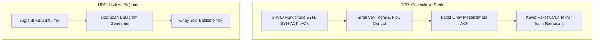
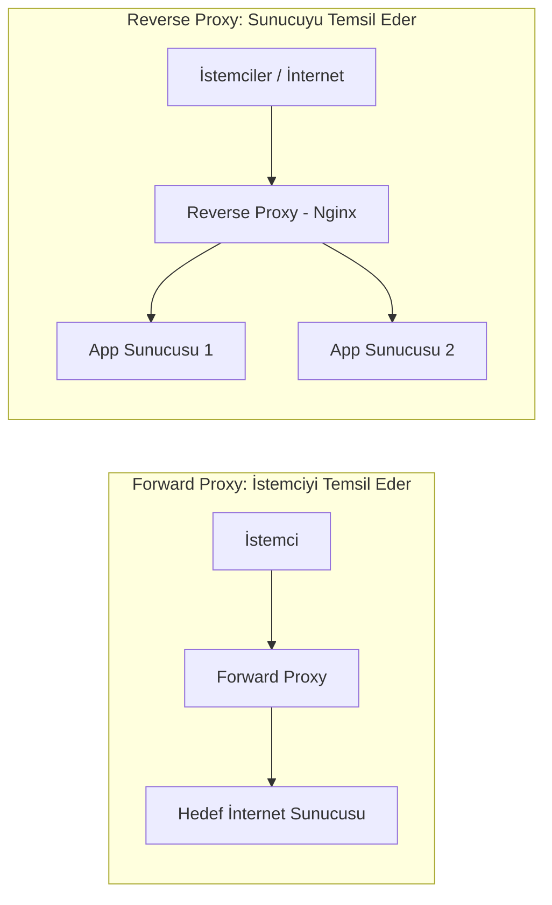
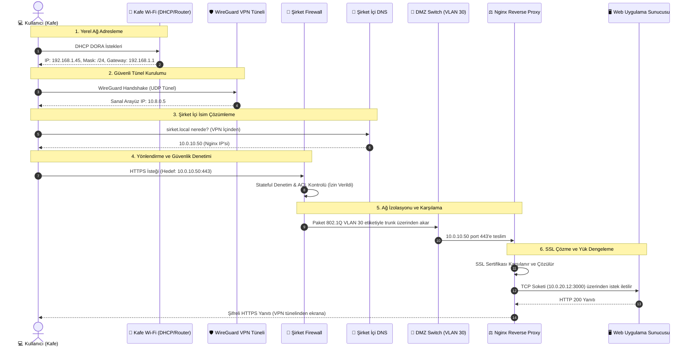

# 🌐 Kapsamlı Ağ Yapıları, Protokoller ve Mimari Rehberi

Bu rehber; bilgisayar ağlarının temel adresleme mekanizmalarından güvenlik protokollerine, yönlendirmeden modern dağıtık sistem mimarilerine kadar uzanan kavramları **teorik temeller**, **teknik parametreler**, **günlük hayat analojileri** ve **sektörel kullanım senaryoları** ile ele almaktadır.

---

## 📑 İçindekiler

- [Özet Referans Tablosu (Hızlı Bakış)](#-özet-referans-tablosu-hızlı-bakış)
- [Modül 1: Ağın Kimlik ve Adresleme Temelleri](#-modül-1-ağın-kimlik-ve-adresleme-temelleri)
  - [1. MAC Adresi (Media Access Control)](#1-mac-adresi-media-access-control)
  - [2. IP Adresi (IPv4 & IPv6)](#2-ip-adresi-ipv4--ipv6)
  - [3. Subnet Mask (Alt Ağ Maskesi) & CIDR](#3-subnet-mask-alt-ağ-maskesi--cidr)
  - [4. Default Gateway (Varsayılan Ağ Geçidi)](#4-default-gateway-varsayılan-ağ-geçidi)
- [Modül 2: Dinamik Yapılandırma ve Çözümleme Protokolleri](#-modül-2-dinamik-yapılandırma-ve-çözümleme-protokolleri)
  - [5. ARP (Address Resolution Protocol)](#5-arp-address-resolution-protocol)
  - [6. DHCP (Dynamic Host Configuration Protocol)](#6-dhcp-dynamic-host-configuration-protocol)
  - [7. DNS (Domain Name System)](#7-dns-domain-name-system)
- [Modül 3: Taşıma Katmanı, Portlar ve İletim Mekanizmaları](#-modül-3-taşıma-katmanı-portlar-ve-iletim-mekanizmaları)
  - [8. TCP & UDP Karşılaştırması](#8-tcp--udp)
  - [9. Portlar ve Sockets](#9-portlar-ve-sockets)
- [Modül 4: Yönlendirme, İzolasyon ve Ağ Çevirisi](#-modül-4-yönlendirme-izolasyon-ve-ağ-çevirisi)
  - [10. NAT (Network Address Translation)](#10-nat-network-address-translation)
  - [11. VLAN (Virtual Local Area Network) & Trunking](#11-vlan-virtual-local-area-network--trunking)
- [Modül 5: Güvenlik, Tünelleme ve Yönlendirme Servisleri](#-modül-5-güvenlik-tünelleme-ve-yönlendirme-servisleri)
  - [12. Firewall (Güvenlik Duvarı)](#12-firewall-güvenlik-duvarı)
  - [13. VPN (Virtual Private Network)](#13-vpn-virtual-private-network)
  - [14. Proxy (Vekil Sunucu: Forward vs Reverse)](#14-proxy-vekil-sunucu)
- [Modül 6: Bütünleşik Uygulama Senaryosu (Uçtan Uca Örnek)](#-modül-6-bütünleşik-uygulama-senaryosu-uçtan-uca-örnek)

---

## 📊 Özet Referans Tablosu (Hızlı Bakış)

| Protokol / Kavram | OSI Katmanı | Adresleme / Biçim | Temel Görevi |
| :--- | :--- | :--- | :--- |
| **MAC** | Katman 2 (Data Link) | 48-bit Hex (`52:54:00:...`) | Yerel ağdaki fiziksel kart kimliği |
| **IP (IPv4/IPv6)** | Katman 3 (Network) | 32-bit Dot / 128-bit Hex | Ağlar arası mantıksal yönlendirme |
| **Subnet Mask & CIDR** | Katman 3 (Network) | `/24`, `255.255.255.0` | Ağ kimliği (Network) ile Cihazı (Host) ayırma |
| **Default Gateway** | Katman 3 (Network) | Yerel Router IP'si | Bilinmeyen hedefler için çıkış kapısı |
| **ARP** | Katman 2.5 / 2-3 Arası | IP $\leftrightarrow$ MAC Eşlemesi | IP adresinden donanım adresini bulma |
| **DHCP** | Katman 7 (Uygulama - UDP 67/68) | Otomatik IP/Konfigürasyon | Cihazlara dinamik ağ parametreleri atama |
| **DNS** | Katman 7 (Uygulama - UDP/TCP 53) | FQDN $\leftrightarrow$ IP Eşlemesi | Alan adlarını IP adreslerine çevirme |
| **TCP** | Katman 4 (Transport) | 3-Way Handshake, Segment | Güvenilir, sıralı, kayıpsız veri iletimi |
| **UDP** | Katman 4 (Transport) | Datagram, Bağlantısız | Hızlı, düşük gecikmeli, teyitsiz iletim |
| **Port & Socket** | Katman 4 (Transport) | 16-bit (`0-65535`) / `IP:Port` | Cihaz üzerindeki spesifik uygulamayı ayırma |
| **NAT (SNAT/DNAT)** | Katman 3 / 4 (Network/Transport) | IP & Port Çevirisi | Yerel IP'leri internete çıkarma ve port yönlendirme |
| **VLAN (802.1Q)** | Katman 2 (Data Link) | 12-bit VLAN Tag (1-4094) | Fiziksel switch'i mantıksal alt ağlara bölme |
| **Firewall** | Katman 3, 4, 7 (NGFW) | Stateful Denetim / ACL | Kurallara göre ağ trafiğini filtreleme |
| **VPN** | Katman 3 / Katman 4 Tünel | IPsec, WireGuard, OpenVPN | Güvensiz ağ üzerinden şifreli tünel kurma |
| **Proxy** | Katman 7 (Uygulama) | Forward / Reverse Proxy | İstemci veya sunucu adına vekillik yapma |

---

## 🧱 Modül 1: Ağın Kimlik ve Adresleme Temelleri

### 1. MAC Adresi (Media Access Control)

* **Nedir:** Ağ Arayüz Kartının (NIC) üretici tarafından donanıma kazınmış fiziksel ve benzersiz 48-bit (6 oktet) kimliğidir.  
  * *Format Örneği:* `52:54:00:12:34:56` (İlk 3 oktet `OUI` üretici kodu, son 3 oktet benzersiz cihaz seri no'sudur).
* **Kullanım Amacı:** OSI 2. Katmanda (Data Link) aynı yerel ağ (LAN) içindeki switch'lerin paketleri hedef cihazın portuna doğru anahtarlaması (switching) için kullanılır.
  * *Basit PC Örneği:* Aynı switch'e kabloyla bağlı 3 bilgisayar düşünelim:
    * **PC-1 (Port 1'e takılı):** MAC: `AA:AA:AA:AA:AA:AA`
    * **PC-2 (Port 2'ye takılı):** MAC: `BB:BB:BB:BB:BB:BB`
    * **PC-3 (Port 3'e takılı):** MAC: `CC:CC:CC:CC:CC:CC`

    PC-1, PC-2'ye yerel ağdan bir dosya göndermek istediğinde, paketin Ethernet çerçevesindeki "Hedef MAC" kısmına PC-2'nin adresi olan `BB:BB:BB:BB:BB:BB` yazılır. Paket switch'e ulaştığında switch kendi hafızasındaki **MAC Tablosuna (CAM Table)** bakar ve bu adresin **Port 2**'de olduğunu görür. Paketi gereksiz yere PC-3'e göndermez; **doğrudan ve yalnızca Port 2'ye iletir**. Böylece ağ trafiği boğulmaz ve güvenli bir iletim sağlanır.
* **Ayar, Değiştirme & Sabitleme Mekanizmaları:**
  * **İşletim Sistemi Seviyesinde Geçici Değiştirme (MAC Spoofing):**  
    Fiziksel donanımdaki kalıcı fabrika çıkış adresine (BIA - *Burned-in Address*) dokunulmaz; işletim sistemi çekirdeğindeki sanal ağ yığınında geçici olarak ezilir (override):
    ```bash
    # Mevcut MAC adresini ve arayüz durumunu görüntüleme
    ip link show eth0

    # Arayüzü durdur, adresi değiştir ve tekrar ayağa kaldır (MAC Spoofing)
    sudo ip link set dev eth0 down
    sudo ip link set dev eth0 address 00:11:22:33:44:55
    sudo ip link set dev eth0 up
    ```
  * **Sanal Makinelerde (KVM/libvirt/VMware) MAC Sabitleme ve Değiştirme:**  
    Sanal makinelerde gerçek bir fiziksel ağ kartı yoktur; hipervizör (hypervisor) işletim sistemine sanal bir kart (**vNIC**) emüle eder. Eğer sanal makine oluşturulurken MAC elle atanmazsa, hipervizör rastgele bir MAC adresi türetir. Klonlanan veya yeniden oluşturulan sanal makinelerin her seferinde aynı kimliğe sahip olması için XML yapılandırma dosyasında MAC **sabitlenir**.
    
    *KVM/libvirt XML Örneği (`virsh edit <vm_adi>`):*
    ```xml
    <devices>
      <interface type='network'>
        <!-- Sanal makinenin sabit donanımsal kimliği -->
        <mac address='52:54:00:1a:2b:3c'/>
        <source network='default'/>
        <model type='virtio'/>
      </interface>
    </devices>
    ```
    > 🏷️ **Hipervizör OUI Standartları:** Sanal makineler üretilirken çakışmaları önlemek için özel üretici önekleri kullanılır:
    > - **KVM / QEMU:** `52:54:00:xx:xx:xx`
    > - **VMware ESXi/Workstation:** `00:50:56:xx:xx:xx` veya `00:0c:29:xx:xx:xx`
    > - **Oracle VirtualBox:** `08:00:27:xx:xx:xx`

  * **MAC Adresi ile DHCP Rezervasyonu Nasıl Güvenceye Alınır? (Sıfırdan Mantık Zinciri):**
    > ℹ️ *Ön Bilgi: Ağlarda cihazlara otomatik IP adresi dağıtan merkezi bir yazılım/cihaz bulunur (Buna **DHCP Sunucusu** denir; evlerde bu görevi modem yapar. Detayları [Modül 2 / Madde 6'da](#6-dhcp-dynamic-host-configuration-protocol) göreceğiz).*

    1. **Sanal Makine Açılır ve İstek Gönderir:**  
       Yeni kurulan sanal makine ilk kez açıldığında henüz bir IP adresine sahip değildir. Ancak yukarıdaki XML tanımı sayesinde **`52:54:00:1a:2b:3c` şeklinde sabit bir donanım (MAC) kimliği** vardır. Sanal makine ağa bir paket fırlatır:  
       > *"Ben `52:54:00:1a:2b:3c` MAC adresine sahip bir makineyim, ağda iletişim kurabilmem için bana bir IP adresi verin!"*
    
    2. **DHCP Sunucusu İsteği Yakalar ve Eşleştirir:**  
       Ağdaki modem/DHCP sunucusu bu çağrıyı duyar. Normal şartlarda DHCP sunucusu boşta duran rastgele bir IP atar (ve bu IP ileride değişebilir). Ancak bir sunucunun IP'sinin sürekli değişmesi felakettir. Bu yüzden ağ yöneticisi DHCP sunucusunun yönetim paneline önceden şu kuralı yazar (**Rezervasyon / Static Lease**):  
       ```text
       Kural: "Eğer IP isteyen cihazın MAC adresi 52:54:00:1a:2b:3c ise -> Rastgele IP verme, HER ZAMAN 192.168.1.100 IP'sini teslim et!"
       ```
    
    3. **Büyük Avantajı:**  
       Sanal sunucunun işletim sistemi içine girip elle statik IP yapılandırması (`netplan`, `ifcfg` vb.) yapmakla uğraşmazsınız. Sanal makineyi silseniz, formatlasanız veya yeniden kursanız dahi; XML şablonunda MAC adresi sabit olduğu sürece açılır açılmaz DHCP'den aynı rezerve IP'yi (`192.168.1.100`) çeker. Böylece web veya veritabanı sunucunuzun IP'si hiçbir zaman kaybolmaz; güvenlik duvarı ve alan adı yönlendirmeleriniz asla bozulmaz.
* **Gündelik Hayatta Karşılığı:**  
  > 💡 **Analoji:** Bir insanın **T.C. Kimlik Numarası** gibidir; kişi nereye taşınırsa taşınsın bu kimlik sabittir. Evdeki Wi-Fi modeminizde *"MAC Filtreleme"* açarak sadece evdeki cihazların MAC adreslerine izin vermek ve komşunuz şifreyi bilse dahi ağa girmesini engellemek en tipik örneğidir.
* **Alternatif Kullanım Amaçları ve Örnekleri:**
  * **Otel / Havaalanı Wi-Fi Süre Sıfırlama (MAC Spoofing):** Havalimanlarındaki 30 dakikalık ücretsiz internet kotaları genelde cihazın MAC adresini veritabanına kaydederek takip eder. Kullanıcılar `macchanger -r wlan0` komutuyla ağ kartının MAC adresini rastgele değiştirip yeni bir cihaz gibi görünerek kotayı sıfırlayabilir.
  * **Wake-on-LAN (WoL):** Bilgisayar tamamen kapalıyken bile ağ kartına hedef MAC adresini içeren 102 baytlık özel bir *"Magic Packet"* (`FF:FF:FF:FF:FF:FF` + 16 kez hedef MAC) gönderilerek cihaz uzaktan uyandırılır.

---

### 2. IP Adresi (IPv4 & IPv6)

* **Nedir:** Cihazların ağlar üzerinde mantıksal olarak konumlanmasını sağlayan, yönlendirilebilir 32-bit (IPv4) veya 128-bit (IPv6) adresleme protokolüdür.
* **Kullanım Amacı:** OSI 3. Katmanda (Network) paketlerin farklı yerel ağlar ve internet omurgası üzerinden hedefe yönlendirilmesini (Routing) sağlar.
* **IPv4 vs IPv6 (Neden Yeni Protokole Geçiyoruz?):**
  * **IPv4 (32-bit):** Yaklaşık $2^{32} \approx 4.3$ milyar adres üretir. 2010'lu yıllarda küresel olarak tükenmiştir; bu nedenle NAT (Network Address Translation) gibi geçici yamalara muhtaç kalınmıştır.
  * **IPv6 (128-bit):** Yaklaşık $2^{128} \approx 3.4 \times 10^{38}$ (trilyonlarca trilyon) adres üretir. Dünyadaki her kum tanesine binlerce IP verilebilecek büyüklüktedir. NAT zorunluluğunu ortadan kaldırır, her cihaz doğrudan genel internette uçtan uca (End-to-End) benzersiz bir IP alır; dahili IPSec desteği ve otomatik yapılandırma (SLAAC) sunar.
* **Temel IP Blokları ve Sınıflandırma:**
  * **Public IP (Genel):** İnternette yönlendirilebilen, ICANN/RIPE tarafından ISP'lere ve kuruluşlara tahsis edilen küresel IP'lerdir.
  * **Private IP (Özel - RFC 1918):** İnternete doğrudan çıkamayan, yerel ağlara ayrılmış bloklardır:
    * `10.0.0.0/8` (Büyük kurumsal yapılar)
    * `172.16.0.0/12` (Orta ölçekli ağlar / Docker container ağları)
    * `192.168.0.0/16` (Ev ve küçük ofis ağları)
  * **Loopback IP (`127.0.0.1` / `::1`):** Cihazın kendi yerel TCP/IP yığınını test eden ve dışarıya paket çıkarmadan yerel servislere bağlanmayı sağlayan adrestir.
  * **APIPA (`169.254.0.0/16`):** DHCP sunucusundan yanıt alınamadığında işletim sisteminin cihaza otomatik atadığı geçici yerel iletişim bloğudur. Bu IP'yi gören bir kullanıcı hemen *"Ağda DHCP sunucusuna ulaşılamıyor"* teşhisini koymalıdır.
* **Gündelik Hayatta Karşılığı:**  
  > 💡 **Analoji:** MAC kimlik kartıysa, IP adresi **evinizin posta adresidir**. Şehir veya sokak değiştirdiğinizde (başka kafeye veya ağa bağlandığınızda) posta adresiniz değişir. Evdeki akıllı ampulün telefon uygulaması üzerinden açılıp kapanması yerel IP (`192.168.1.45`) üzerinden yürür.
* **Alternatif Kullanım Amaçları ve Örnekleri:**
  * **Coğrafi Engellemeler ve Hak Yönetimi:** Netflix, Steam vb. servisler kullanıcının Public IP adresine bakarak (GeoIP) bulunduğu ülkeyi belirler, telif haklarına göre içerik kütüphanesini ve fiyatlandırmayı sınırlar.
  * **Anycast IP Dağıtımı:** Tek bir IP adresi (örn. Cloudflare `1.1.1.1` veya Google `8.8.8.8`) dünyanın 200'den fazla farklı veri merkezinde aynı anda anons edilir (BGP Anycast). Kullanıcı bu IP'ye istek attığında internet yönlendirme algoritmaları isteği fiziksel olarak en yakın veri merkezine uçurur.
  * **Yazılım Geliştirme İzolasyonu (Loopback):** Bilgisayarda geliştirilen bir API servisi (`localhost:3000`), internet bağlantısı olmasa bile `127.0.0.1` üzerinden güvenle test edilir.

---

### 3. Subnet Mask (Alt Ağ Maskesi) & CIDR

* **Nedir:** Bir IP adresinin hangi bitlerinin **Ağ Kimliğini (Network ID)**, hangi bitlerinin ise **Cihaz Kimliğini (Host ID)** temsil ettiğini belirten bit dizisidir (Örnek: `255.255.255.0` veya CIDR gösterimi ile `/24`).
* **Kullanım Amacı:** Büyük ağları mantıksal alt parçalara bölerek (Subnetting) yayın (broadcast) fırtınalarını engellemek, ağ trafiğini yalıtmak ve sınırlı IPv4 havuzundaki israfı önlemek.
* **Kritik Parametreler:**
  * **Network Adresi:** Bir alt ağın ilk adresidir; ağın kendisini tanımlar ve cihazlara atanamaz (Örnek: `192.168.1.0/24`).
  * **Broadcast Adresi:** Alt ağın en son adresidir; o alt ağdaki tüm cihazlara aynı anda paket göndermek için kullanılır (Örnek: `192.168.1.255/24`).
  * **Kullanılabilir Host Sayısı:** Formül: $2^{(32 - CIDR)} - 2$ (Network ve Broadcast adresleri düşülür).
* **Gündelik Hayatta Karşılığı:**  
  > 💡 **Analoji:** Bir sitenin **blok ve daire numarası** ayrımıdır. Adresiniz *"A Blok No: 5"* ise, maske size kimin sizinle aynı blokta (aynı yerel ağda) olduğunu, kimin yan blokta oturduğunu söyler. Yan bloktakine seslenmek için site güvenlik kapısına (Gateway) gitmeniz gerekir.
* **Alternatif Kullanım Amaçları ve Örnekleri:**
  * **Bulut Altyapısı Güvenlik Mimarisi (AWS VPC / GCP) — Derinlemesine İnceleme:**  
    Kurumsal bulut mimarilerinde çok katmanlı (**3-Tier Architecture: Web - App - Database**) güvenlik tasarımı alt ağların (Subnetting) doğru izole edilmesine dayanır:
    
    ```text
    [ İNTERNET ] 
         │ 
         ▼ (Port 80 / 443)
    ┌───────────────────────────────────────────────────────────┐
    │ Public Subnet: 10.0.1.0/24 (Internet Gateway - IGW Açık)  │
    │ └─► Web Sunucuları / Load Balancer (Public IP var)        │
    └─────────────────────────────┬─────────────────────────────┘
                                  │ (Yalnızca Port 5432 - Dahili İletişim)
                                  ▼
    ┌───────────────────────────────────────────────────────────┐
    │ Private Subnet: 10.0.2.0/28 (Dış Dünyaya Tamamen Kapalı)  │
    │ └─► PostgreSQL Veritabanı Kümesi (Yalnızca Private IP)    │
    └───────────────────────────────────────────────────────────┘
    ```

    1. **Neden `/28` Maskesi (Kapasite ve İsraf Önleme)?**  
       * $32 - 28 = 4$ bit host alanı bırakır: $2^4 = 16$ toplam IP adresi.  
       * Standart ağlarda $16 - 2 = 14$ kullanılabilir host bulunur (AWS VPC'de ilk 4 ve son 1 IP bulut servisleri için rezerve edildiğinden geriye tam $11$ IP kalır).  
       * Bir e-ticaret sitesinde web katmanı trafiğe göre 50-100 sunucuya kadar büyüyebilirken (`Auto-scaling`), veritabanı katmanı genellikle 1 Primary (Yazma) + 2 Read Replica (Okuma) gibi az sayıda (3-5 sunucu) düğümden oluşur. Dolayısıyla veritabanına devasa bir `/24` (254 IP) tahsis etmek IP israfıdır; `/28` maskesi hem güvenli hem de tam ihtiyaca uygundur.
    
    2. **Yönlendirme Tablosu (Route Table) İle Fiziksel İzolasyon:**  
       * **Public Subnet:** Yönlendirme tablosunda `0.0.0.0/0 -> igw-xxxx` (*Internet Gateway*) tanımı bulunur; yani doğrudan internete çıkabilir ve internetten istek alabilir.  
       * **Private Subnet:** Yönlendirme tablosunda **kesinlikle Internet Gateway (IGW) rotası yer almaz**. Bu subnet içindeki veritabanı sunucularına bir Public IP tanımlanamaz. Dış dünyadan bir saldırganın bu IP bloğuna doğrudan ping atması veya port taraması yapması fiziksel ve mantıksal olarak imkansızdır.
    
    3. **Güvenlik Grupları (Security Groups / Firewall Kuralları):**  
       * Veritabanının önüne konulan Güvenlik Grubu (SG) kuralı şu şekilde kilitlenir:
         * **Gelen Trafik (Inbound):** `Port 5432 (PostgreSQL)` $\rightarrow$ **Kaynak (Source):** Yalnızca `10.0.1.0/24` (Web Subnet CIDR) veya `sg-web-servers` güvenlik grubu.  
         * **İnternet Kaynağı (`0.0.0.0/0`):** Tamamen engellenmiştir (Drop).  
       * **Sonuç:** Bir saldırgan internet üzerinden veritabanına asla ulaşamaz. Veritabanına erişebilmek için önce `Public Subnet` üzerindeki bir web sunucusunun hacklenmesi (Pivot/Bastion noktası) gerekir. Bu da saldırı yüzeyini minimuma indirir.
  * **Noktadan Noktaya (Point-to-Point) Link Tasarımı:** İki kurumsal omurga router'ını birbirine bağlarken IP israfını önlemek amacıyla yalnızca 2 kullanılabilir IP veren `/30` (`255.255.255.252`) veya RFC 3021 standardı ile broadcast adresi gerektirmeyen `/31` maskeleri kullanılır.

---

### 4. Default Gateway (Varsayılan Ağ Geçidi)

* **Nedir:** Yerel alt ağ (Subnet) dışındaki hedeflere (örneğin internete veya farklı bir VLAN'a) gidecek tüm paketlerin teslim edildiği yönlendiricinin (Router) yerel IP adresidir.
* **Kullanım Amacı:** Yönlendirme tablosunda (Routing Table) özel bir rota kuralı bulunmayan trafiğin (`0.0.0.0/0`) dış dünyaya ulaştırılması.
* **Gateway Yanlış veya Eksik Olursa Ne Olur? (Kritik Sorun Teşhisi):**
  * Yerel ağdaki diğer cihazlarla iletişim **kesintisiz devam eder**. Örneğin同一 `192.168.1.0/24` ağındaki komşu bilgisayara ping atabilir veya yerel ağdaki yazıcıdan çıktı alabilirsiniz; çünkü bu iletişim router'a uğramadan Katman 2'de (Switch üzerinde MAC tablosuyla) gerçekleşir.
  * Ancak internete veya başka bir alt ağa erişmeye çalıştığınız anda işletim sistemi paketi nereye teslim edeceğini bilemez ve `Network is unreachable` (Ağa ulaşılamıyor) hatası verir.
* **Ayar & Parametre:**
  ```bash
  # Linux varsayılan ağ geçidi ekleme ve kontrol
  ip route show
  ip route add default via 192.168.1.1 dev eth0
  ```
  DHCP sunucuları bu bilgiyi istemcilere otomatik olarak **DHCP Option 3** parametresi ile iletir.
* **Gündelik Hayatta Karşılığı:**  
  > 💡 **Analoji:** Evinizin **dış kapısı** veya sitenin **güvenlik nizamiye kapısıdır**. Evin odaları arasında gezerken kapıdan çıkmazsınız; ancak markete gitmek veya başka bir şehre seyahat etmek istediğinizde tek çıkış yolunuz o kapıdır.
* **Alternatif Kullanım Amaçları ve Örnekleri:**
  * **Yedekli Ağ Geçidi Protokolleri (HSRP / VRRP):** Finans kurumlarında veya veri merkezlerinde iki ayrı fiziksel router bulunur. Bu cihazlar ortak bir *"Sanal Gateway IP'si"* tanımlar. Birinci router donanımsal arıza yaşasa bile saniyeler içinde yedek router görevi devralır; istemciler kesinti hissetmez.
  * **Policy-Based Routing (PBR / Çoklu İnternet Çıkışı):** Şirkette biri fiber, diğeri LTE iki hat varken yönlendirici yapılandırılarak kritik muhasebe trafiği fiber gateway'e, misafir Wi-Fi trafiği ise LTE gateway'e sevk edilebilir.

---

## ⚡ Modül 2: Dinamik Yapılandırma ve Çözümleme Protokolleri

### 5. ARP (Address Resolution Protocol)

* **Nedir:** 32-bit mantıksal IPv4 adresini, yerel ağda karşılığı olan 48-bit fiziksel MAC adresine dönüştüren 2. ile 3. katman arasındaki köprü protokoldür.
* **Kullanım Amacı:** Aynı yerel ağdaki bir hedefe paket gönderilirken Ethernet çerçeve başlığına hedef MAC adresinin yazılması gerekir. ARP, bu adresin dinamik olarak öğrenilmesini sağlar.
* **Hedef Aynı Ağda mı, Dışarıda mı? (ARP Karar Mekanizması):**  
  Bilgisayar bir paketi kabloya basmadan önce hedef IP ile kendi Subnet Mask'ını mantıksal `AND` işlemine tabi tutar:
  * **Hedef Yerel Ağdaysa:** Bilgisayar doğrudan hedef makinenin IP'si için ARP sorgusu atar (`Who has 192.168.1.50? Tell 192.168.1.10`).
  * **Hedef İnternette / Farklı Ağdaysa (Örn: `google.com` - `142.250.184.206`):** Bilgisayar asla Google'ın MAC adresini sormaz (çünkü Google başka bir ağdadır ve switch broadcast sınırını aşamaz). Paket IP katmanında Google adresini korurken, Ethernet çerçevesine **Default Gateway'in (Router) MAC adresi** yazılır. Dolayısıyla ARP sorgusu Google için değil, **Gateway IP'si (`192.168.1.1`) için** atılır! Paketi teslim alan Router, paketi internet omurgasına yönlendirir.
* **Ayar & İnceleme:**
  ```bash
  # ARP tablosunu inceleme ve statik kayıt ekleme
  arp -a
  ip neigh show
  # Statik kayıt (ARP spoofing önlemi)
  ip neigh add 192.168.1.1 lladdr 00:11:22:33:44:55 dev eth0 nud permanent
  ```
* **Gündelik Hayatta Karşılığı:**  
  > 💡 **Analoji:** Bir amfide öğretmenin *"Ali Veli burada mı?"* diye sınıfa doğru bağırması (**ARP Request - Broadcast**) ve sadece Ali Veli'nin ayağa kalkıp *"Ben buradayım, kimliğim budur"* demesidir (**ARP Reply - Unicast**).
* **Alternatif Kullanım Amaçları ve Örnekleri:**
  * **Siber Güvenlik / Man-in-the-Middle (ARP Poisoning / Spoofing):** Ağdaki saldırgan bilgisayar, modeme ve kurban cihaza sürekli sahte ARP yanıtları basarak *"Gateway benim MAC adresimdir"* der. Tüm internet trafiği saldırgan üzerinden akarak parolaların ve şifresiz oturumların ele geçirilmesine yol açabilir.
  * **Proxy ARP:** Bir yönlendiricinin, farklı bir alt ağdaki hedef cihaz adına ARP isteklerine kendi MAC adresini dönerek yanıt vermesi; böylece yönlendirme altyapısını istemciden gizleyerek iletişimi sağlaması.

---

### 6. DHCP (Dynamic Host Configuration Protocol)

* **Nedir:** Ağa yeni katılan cihazlara otomatik IP adresi, alt ağ maskesi, varsayılan ağ geçidi ve DNS gibi yapılandırma parametrelerini dinamik olarak dağıtan protokoldür (UDP 67 - Sunucu, UDP 68 - İstemci).
* **DORA Süreci:**
  ```mermaid
  sequenceDiagram
    autonumber
    participant Client as İstemci (PC/Mobil)
    participant DHCP as DHCP Sunucusu (Router)
    Client->>DHCP: Discover (Broadcast: IP arıyorum!)
    DHCP->>Client: Offer (Unicast/Broadcast: 192.168.1.50 uygun)
    Client->>DHCP: Request (Broadcast: 192.168.1.50'yi rezerve et lütfen)
    DHCP->>Client: Acknowledge (Unicast/Broadcast: Tamam, süre 24 saat)
  ```
* **Temel Yapılandırma Parametreleri:**
  * **Scope / IP Pool:** Dağıtılacak IP adres aralığı (örn. `192.168.1.50 - 192.168.1.200`).
  * **Lease Time (Kira Süresi):** IP adresinin istemciye tahsis edilme süresi.
  * **DHCP Options:**
    * *Option 3:* Default Gateway
    * *Option 6:* DNS Sunucuları
    * *Option 15:* Domain Name (Yerel arama soneki)
    * *Option 66 / 67:* PXE Boot TFTP sunucu IP'si ve boot dosyası adı
    * *Option 150:* VoIP PBX Sunucu IP'si
  * **DHCP Relay Agent:** Farklı VLAN'lardaki istemcilerin tek bir merkezi DHCP sunucusundan IP alabilmesi için router üzerinde tanımlanan aktarıcıdır (ip helper-address).
* **Gündelik Hayatta Karşılığı:**  
  > 💡 **Analoji:** Bir otele giriş yaptığınızda resepsiyon görevlisinin size **oda anahtarı, otel kuralları kitapçığı ve Wi-Fi şifresi** vermesidir. Otelden ayrıldığınızda o oda başkasına tahsis edilir.
* **Alternatif Kullanım Amaçları ve Örnekleri:**
  * **Ağdan Otomatik Kurulum (PXE Boot):** Yüzlerce istemci bilgisayara USB bellek olmadan işletim sistemi kurmak için DHCP Option 66 ve 67 yapılandırılır. Bilgisayarlar açılır açılmaz ağdan işletim sistemi imajını indirip otomatik yükleme yapar.
  * **IP Telefon (VoIP) Provizyonu:** Masalardaki IP telefonlar ağa bağlandığında DHCP Option 150 ile santral adresini öğrenir; kullanıcı adı, şifre ve hat ayarlarını santralden otomatik çekerek kullanıma hazır hale gelir.

---

### 7. DNS (Domain Name System)

* **Nedir:** İnsanların okuyabildiği alan adlarını (FQDN: `ornek.com`) bilgisayarların anladığı sayısal IP adreslerine (`93.184.216.34`) dönüştüren küresel, dağıtık veritabanıdır (Port 53 UDP/TCP).
* **Kritik DNS Kayıt Türleri:**
  | Kayıt | Görevi | Örnek Değer |
  | :--- | :--- | :--- |
  | **A** | Alan adını IPv4 adresine eşler | `google.com -> 142.250.184.206` |
  | **AAAA** | Alan adını IPv6 adresine eşler | `google.com -> 2a00:1450:4001:828::200e` |
  | **CNAME** | Bir alan adını başka bir alan adına takma ad (alias) yapar | `www.site.com -> site.com` |
  | **MX** | Alan adına ait gelen e-posta sunucularını ve önceliklerini belirtir | `10 mail.site.com` |
  | **PTR** | IP adresinden alan adını bulur (Reverse DNS) | `1.1.1.1 -> one.one.one.one` |
  | **TXT** | Güvenlik ve doğrulama metinleri içerir | `v=spf1 include:_spf.google.com ~all` |
  | **NS** | O bölgeden sorumlu yetkili DNS sunucularını belirtir | `ns1.cloudflare.com` |
  | **SOA** | Bölgenin seri numarası, yenileme ve TTL temel kurallarını tutar | Master DNS yetki kaydı |
* **DNS Sorgusu Sırasıyla Nereye Gider? (Hiyerarşik Çözümleme Adımları):**
  Bir tarayıcıya `www.google.com` yazıp Enter'a bastığınızda sırasıyla şu zincir işletilir:
  1. **Tarayıcı Önbelleği (Browser Cache):** Tarayıcı yakın zamanda bu adrese gitti mi? (Evetse anında IP döner).
  2. **İşletim Sistemi Önbelleği & `hosts` Dosyası:** Bilgisayarın yerel DNS hafızası ve statik `hosts` dosyası kontrol edilir.
  3. **Recursive DNS Çözücüsü (Özyinelemeli Sunucu):** Ev modemi, ISP DNS'i veya genel çözücüler (`1.1.1.1`, `8.8.8.8`). Cevap önbellekte yoksa kök sunuculara doğru sorgulama maratonunu başlatır:
     * **Kök DNS (Root Server - `.`):** Sorguyu `.com` TLD sunucusuna paslar.
     * **TLD Sunucusu (`.com`):** Sorguyu alan adının yetkili sunucusuna (`ns1.google.com`) paslar.
     * **Yetkili DNS (Authoritative Server):** Domain'in gerçek sahibi olan sunucudur; IP adresini (`142.250.184.206`) Recursive sunucuya iletir.
  4. **Önbellekleme & TTL (Time-to-Live):** Recursive çözücü bu IP'yi kayıtlı TTL süresince saklar ve istemciye teslim eder; sonraki kullanıcılar için sorgu anında cevaplanır.
* **Gündelik Hayatta Karşılığı:**  
  > 💡 **Analoji:** Telefonunuzdaki **rehber uygulamasıdır**. Arkadaşınızı ararken onun 11 haneli numarasını ezberlemezsiniz; listeden ismini seçersiniz, telefon arka planda numarayı çevirir.
* **Alternatif Kullanım Amaçları ve Örnekleri:**
  * **Ağ Seviyesinde Reklam Engelleme (Pi-hole / DNS Sinkholing):** Yerel ağa kurulan bir Pi-hole, bilinen reklam ve takipçi domain'lerini kara listeye alır. Akıllı televizyon veya telefon bir reklam domain'ini çözmek istediğinde DNS yanıtı olarak `0.0.0.0` döner ve reklamlar hiçbir uygulama kurulmadan tüm ev ağında engellenir.
  * **E-Posta Sahteciliği Engelleme (SPF, DKIM, DMARC):** TXT kayıtları kullanılarak kurum adına sahte e-posta gönderilmesi engellenir. Alıcı sunucu, gelen e-postanın kurumun DNS kayıtlarında yetkilendirilmiş IP'lerden gelip gelmediğini kontrol eder.
  * **DNS Tabanlı Coğrafi Yük Dengeleme (GeoDNS):** Kullanıcı siteye Avrupa'dan eriştiğinde Frankfurt veri merkezinin IP'si, Asya'dan eriştiğinde Singapur veri merkezinin IP'si döndürülerek en düşük gecikme sağlanır.

---

## 🚀 Modül 3: Taşıma Katmanı, Portlar ve İletim Mekanizmaları

### 8. TCP & UDP

Taşıma katmanı (Transport Layer - Katman 4), verinin iki uç cihaz arasındaki uygulamalar arasında nasıl aktarılacağını belirler.



#### TCP vs UDP Karşılaştırması

| Özellik | TCP (Transmission Control Protocol) | UDP (User Datagram Protocol) |
| :--- | :--- | :--- |
| **Bağlantı Durumu** | Bağlantı odaklı (3-Way Handshake gerekir) | Bağlantısız (Connectionless) |
| **Güvenilirlik** | Yüksek (Kayıp paketler tekrar gönderilir) | Düşük (Kayıp tespiti ve tekrarı yoktur) |
| **Sıralama** | Sıralı teslimat garanti edilir | Paketler farklı sırayla varabilir |
| **Gecikme & Başlık Yükü** | Yüksek (Minimum 20 byte başlık) | Çok Düşük (Yalnızca 8 byte başlık) |
| **Akış ve Tıkanıklık Kontrolü** | Var (Windowing, Congestion Avoidance) | Yok |
| **Tipik Protokoller** | HTTP/HTTPS, SSH, FTP, SMTP, MySQL | DNS, DHCP, VoIP, Canlı Yayın, SNMP |

* **Gündelik Hayatta Karşılığı:**  
  * **TCP:** **İadeli taahhütlü mektuptur.** Alıcı teslim aldığına dair imza atar; posta yolda kaybolursa postane aynısını tekrar ulaştırır.
  * **UDP:** **Canlı stadyum anonsu veya radyo yayınıdır.** O an bir kelimeyi kaçırırsanız yayın durup tekrar etmez, akış kesilmeden devam eder.
* **Alternatif Kullanım Amaçları ve Örnekleri:**
  * **QUIC Protokolü (HTTP/3):** Google ve Cloudflare öncülüğünde geliştirilen modern web standardı; TCP'nin bağlantı gecikmelerini (Handshake) ve hat başı tıkanmalarını (Head-of-Line Blocking) aşmak için UDP üzerinde şifreli ve güvenilir yeni bir taşıma katmanı kurmuştur. Modern tarayıcılar HTTPS trafiğini artık UDP 443 üzerinden çekmektedir.
  * **Yoğun Log İletimi (Syslog UDP 514):** Saniyede yüz binlerce log satırı üreten sunucularda diskin veya uygulamanın kilitlenmemesi için loglar UDP üzerinden *"fire-and-forget"* mantığıyla log sunucusuna basılır; birkaç satır kaybolsa bile ana sistemin çalışması aksamaz.

---

### 9. Portlar ve Sockets

* **Nedir:**  
  * **Port:** Bir cihaz üzerinde aynı anda çalışan binlerce ağ uygulamasını birbirinden ayıran 16-bitlik mantıksal numaradır (`0 - 65535` arası).  
    * *Well-Known Ports:* `0 - 1023` (SSH: 22, HTTP: 80, HTTPS: 443 vb.)  
    * *Registered Ports:* `1024 - 49151` (MySQL: 3306, PostgreSQL: 5432 vb.)  
    * *Dynamic / Ephemeral Ports:* `49152 - 65535` (Giden istemci bağlantıları)
  * **Socket:** Bir IP adresi ile bir Port numarasının birleşimidir (Örnek: `192.168.1.10:443`). İki uygulama arasındaki tekil oturumu temsil eder.
* **Gündelik Hayatta Karşılığı:**  
  > 💡 **Analoji:** Bir holding plazanın ana giriş kapı adresi **IP** ise, içerideki departmanların dahili oda numaraları **Port**lardır. Muhasebe için Dahili 80'e, Bilgi İşlem için Dahili 22'ye gidersiniz.
* **Alternatif Kullanım Amaçları ve Örnekleri:**
  * **Port Knocking (Güvenlik Amaçlı Gizli Kapı Tıklatma):** Sunucuda kritik SSH portu (22) dış dünyaya tamamen kapalı tutulur. Yönetici sunucuya önceden belirlenmiş gizli port sırasıyla (örn: UDP 7000 $\rightarrow$ TCP 8500 $\rightarrow$ TCP 9200) paket gönderdiğinde, güvenlik duvarı o yöneticinin IP'sine 30 saniyeliğine 22 portunu açar.
  * **Mikroservis ve Container Mimarileri:** Tek bir fiziksel sunucu üzerinde Docker ile çalışan onlarca mikroservis; `localhost:8001`, `localhost:8002`, `localhost:5432` gibi farklı port soketlerini dinleyerek aynı işletim sistemi çekirdeğini çakışmadan paylaşır.

---

## 🔀 Modül 4: Yönlendirme, İzolasyon ve Ağ Çevirisi

### 10. NAT (Network Address Translation)

* **Nedir:** Paketlerin IP başlığındaki kaynak (Source) veya hedef (Destination) IP ve port bilgilerinin yönlendirici üzerinde değiştirilerek aktarılması tekniğidir.
* **Temel Türleri:**
  * **SNAT (Source NAT):** İç ağdan dışarıya giden paketlerin yerel kaynak IP'si, yönlendiricinin genel (Public) IP'si ile değiştirilir.
  * **PAT (Port Address Translation / NAT Overload):** Yüzlerce cihazın tek bir Public IP üzerinden farklı rastgele istemci portları açılarak internete çıkarılmasıdır (Ev modemlerindeki standart çalışma biçimi).
  * **DNAT (Destination NAT / Port Forwarding):** Dış dünyadan yönlendiricinin Public IP'sine ve belirli bir portuna gelen isteğin, iç ağdaki belirli bir yerel sunucuya (`192.168.1.100:80`) yönlendirilmesidir.
* **PAT Çeviri Tablosu Nasıl Çalışır? (Dönüş Paketini Modem Kime Vereceğini Nereden Bilir?):**
  Evdeki iki telefon aynı anda Google'a bağlandığında modem ikisini de tek Public IP'si (`88.240.12.5`) arkasından çıkarır:
  ```text
  [İç Cihaz Soketi]        ──► [Modem NAT Tablosu (Dışarı Çıkış)] ──► [Hedef Web Sunucu]
  192.168.1.15:52110       ──► 88.240.12.5:41001                 ──► 142.250.184.206:443
  192.168.1.20:53400       ──► 88.240.12.5:41002                 ──► 142.250.184.206:443
  ```
  Google sunucusu cevabı modemin `41002` nolu portuna döndüğünde, modem hafızasındaki tabloya bakar: *"41002 portu içerideki `192.168.1.20:53400` cihazına aitti"* der ve paketi doğrudan o telefona teslim eder. Paketler asla birbirine karışmaz.
* **Gündelik Hayatta Karşılığı:**  
  > 💡 **Analoji:** Bir şirketin santral numarası gibidir. 500 çalışanın dışarıya doğru aramalarında karşı taraf sadece şirketin ana santral numarasını görür (**SNAT/PAT**). Müşteri şirketi arayıp *"Dahili 105'i bağlayın"* dediğinde ise santral çağrıyı ilgili personelin masasına aktarır (**Port Forwarding / DNAT**).
* **Alternatif Kullanım Amaçları ve Örnekleri:**
  * **CGNAT (Carrier-Grade NAT) ve Tünelleme Çözümleri:** İnternet servis sağlayıcıları IPv4 tükendiği için ev kullanıcılarına gerçek Public IP vermek yerine binlerce aboneyi tek bir IP havuzunun arkasında toplar. Bu durum evde port açmayı engeller. Çözüm olarak Cloudflare Tunnel, Tailscale veya harici bir VPS üzerinden ters SSH tünelleri kurulur.
  * **Şirket Birleşmelerinde Çakışan IP Çözümü (Twice NAT):** İki farklı şirket birleştiğinde her iki şirketin yerel alt ağı da `192.168.1.0/24` ise ağlar haberleşemez. Aradaki router üzerinde Twice-NAT yapılandırılarak her iki tarafın paketleri geçici sanal bloklara dönüştürülür ve sistemler yeniden kurulmadan haberleşme sağlanır.

---

### 11. VLAN (Virtual Local Area Network) & Trunking

* **Nedir:** Fiziksel bir switch altyapısını yazılımsal ve mantıksal olarak birbirinden tamamen bağımsız yayın alanlarına (Broadcast Domain) bölme teknolojisidir.
* **Temel Kavramlar:**
  * **VLAN ID:** 12-bitlik değer (`1 - 4094` arası).
  * **Access Port:** Yalnızca tek bir VLAN'a ait olan ve uç cihazlara (PC, yazıcı) giden etiketlenmemiş (untagged) port.
  * **Trunk Port:** Birden fazla VLAN'a ait paketleri üzerinde **IEEE 802.1Q** standardı etiketleriyle (VLAN Tag) taşıyan omurga port (Switch-Switch veya Switch-Router arası).
* **Paket Yaşam Döngüsü (Etiket Nerede Takılır, Nerede Sökülür?):**
  1. Standart bilgisayarlar veya yazıcılar VLAN etiketini (802.1Q başlığını) tanımaz. PC switch'e normal (etiketsiz) paket gönderir.
  2. Switch paketi **Access Port** üzerinden kabul ettiği anda pakete o portun VLAN numarasını (örn: `VLAN 10`) yapıştırır (*Tagging*).
  3. Paket başka bir switch'e veya router'a giderken **Trunk Port** üzerinden bu etiketle taşınır.
  4. Hedef bilgisayarın bağlı olduğu switch, paketi karşı taraftaki **Access Port**'tan çıkarmadan hemen önce üzerindeki etiketi söker (*Untag*) ve bilgisayara standart Ethernet paketi olarak teslim eder.
* **Gündelik Hayatta Karşılığı:**  
  > 💡 **Analoji:** Bir plazadaki **tek bir asansör kabininin** hem normal çalışanlar hem de kartını okutan VIP yöneticiler tarafından kullanılmasıdır. Aynı fiziksel ray kullanılır ancak çalışanlar VIP kata basamaz veya o kattaki odalara erişemez.
* **Alternatif Kullanım Amaçları ve Örnekleri:**
  * **Ev ve KOBİ Ağlarında IoT İzolasyonu:** Güvenlik açığı barındırabilecek akıllı süpürgeler, IP kameralar veya ampuller için `VLAN 20 (IoT)` tanımlanır. Bu cihazlar internete çıkabilir ancak evdeki bilgisayarların ve kişisel verileri tutan NAS depolama cihazının bulunduğu `VLAN 10` ağına kesinlikle erişemez.
  * **Sanallaştırma Altyapısı (VMware ESXi / Proxmox / KVM):** Sunucuya bağlı tek bir 10G fiziksel hat (Trunk Port), üzerinde 50 farklı VLAN taşır. Sanal makinelerin sanal ağ kartları (vNIC) doğrudan bu VLAN ID'lerine bağlanarak tamamen yalıtılmış DMZ, Uygulama ve Veritabanı katmanları kurulur.

---

## 🛡️ Modül 5: Güvenlik, Tünelleme ve Yönlendirme Servisleri

### 12. Firewall (Güvenlik Duvarı)

* **Nedir:** Belirlenmiş güvenlik kuralları doğrultusunda ağ paketlerini inceleyen, geçişine izin veren veya engelleyen (Drop/Reject) donanım veya yazılım sistemidir.
* **Stateful Inspection (Durum Denetimli Güvenlik):** Yalnızca tekil paket başlıklarına bakmaz; oturum tablosu (Connection State Table) tutar. İç ağdan dışarıya başlatılan bir bağlantının (örneğin webde gezinirken gelen yanıt paketlerinin) geri dönüşüne güvenlik duvarı otomatik olarak izin verir (`ESTABLISHED, RELATED`).
* **Örnek Kurallar (Linux `iptables` / `nftables`):**
  ```bash
  # Giden bağlantıların dönüşüne otomatik izin ver (Stateful)
  iptables -A INPUT -m conntrack --ctstate ESTABLISHED,RELATED -j ACCEPT
  # 22 numaralı SSH portuna gelen yeni istekleri kabul et
  iptables -A INPUT -p tcp --dport 22 -m conntrack --ctstate NEW -j ACCEPT
  # Kalan tüm gelen paketleri düşür
  iptables -P INPUT DROP
  ```
* **Gündelik Hayatta Karşılığı:**  
  > 💡 **Analoji:** Bir gece kulübünün kapısındaki **güvenlik görevlisidir**. Sadece listede adı olanlar içeri girebilir; içeriden bir müşteri hava almak için kapıya çıkıp geri döndüğünde koruma onu tanıdığı için (**Stateful Inspection**) tekrar kimlik sormadan içeri alır.
* **Alternatif Kullanım Amaçları ve Örnekleri:**
  * **DDoS Koruması ve Rate Limiting:** Web sunucusunun önüne konulan güvenlik duvarı kurallarıyla aynı IP adresinden 1 saniyede 100'den fazla istek gelirse bu IP adresi geçici olarak kara listeye alınır.
  * **Coğrafi Engelleme (Geo-IP Blocking):** Yalnızca yerel pazara hizmet veren bir servis, saldırı yüzeyini daraltmak için güvenlik duvarı seviyesinde ülke dışı IP bloklarından gelen web ve yönetim portlarını toptan engelleyebilir.

---

### 13. VPN (Virtual Private Network)

* **Nedir:** Güvenilir olmayan bir ağ (örneğin genel internet) üzerinden iki uç nokta arasında kriptografik olarak şifrelenmiş, yalıtılmış sanal bir tünel kuran ağ teknolojisidir.
* **Temel Türleri ve Protokoller:**
  * **Remote Access VPN:** Bireysel kullanıcıların şirket ağına bağlanması (WireGuard, OpenVPN, Cisco AnyConnect).
  * **Site-to-Site VPN:** İki farklı lokasyondaki ofisin router'ları arasında kalıcı tünel açılması (IPsec IKEv2).
* **Full Tunnel vs Split Tunnel (Kritik Mimari Ayrımı):**
  * **Full Tunnel (Tam Tünel):** Cihazın ürettiği **tüm internet trafiği** (YouTube, haber siteleri dahil) VPN tüneli üzerinden şirket merkezine akar. Güvenlik en üst seviyedir (şirket tüm trafiği denetler) ancak şirketin internet bant genişliğini tüketir ve kullanıcının kişisel internet hızını yavaşlatabilir.
  * **Split Tunnel (Ayrık Tünel):** Yalnızca şirket içi IP bloklarına (`10.0.0.0/8`, `192.168.50.0/24`) giden istekler şifreli tünelden geçer. Kullanıcının normal internet aramaları, müzik ve video akışları kullanıcının kendi yerel internetinden doğrudan çıkar. Hızlıdır ve bant genişliğini korur.
* **Gündelik Hayatta Karşılığı:**  
  > 💡 **Analoji:** Kalabalık bir caddenin altından iki bina arasına kazılmış **özel, kilitli ve zırhlı bir yer altı geçididir**. Dışarıdakiler içeriden ne taşındığını göremez; tüneli kullananlar caddedeki tehlikelerden etkilenmeden hedefe varır.
* **Alternatif Kullanım Amaçları ve Örnekleri:**
  * **Uzaktan Çalışma (Work From Anywhere):** Evdeki bir yazılımcının şirket VPN'ine bağlanarak ofisteki kabloya bağlıymış gibi staging sunucularına, veritabanlarına ve şirket içi Jira'ya güvenle erişmesi.
  * **Halka Açık Wi-Fi Koruması:** Otel veya kafelerdeki şifresiz ağlarda gezinirken diğer kullanıcıların paketleri dinlemesini (sniffing) önlemek için cihazın tüm trafiğini evdeki WireGuard sunucusuna yönlendirmesi.
  * **Fabrika ve Şube Birleştirme:** Ankara'daki merkez ile Bursa fabrikasındaki yönlendiriciler arasında kurulan kalıcı IPsec tüneli sayesinde barkod okuyucuların internete çıkmadan doğrudan yerel IP'lerle sunuculara veri aktarması.

---

### 14. Proxy (Vekil Sunucu)

Vekil sunucular istemci ile hedef sunucu arasına girerek trafiği denetler, önbelleğe alır veya yönlendirir.



#### Forward Proxy vs Reverse Proxy

| Kriter | Forward Proxy | Reverse Proxy |
| :--- | :--- | :--- |
| **Kimi Korur / Temsil Eder?** | İstemciyi (Client) internetten korur | Sunucuları (Backend) internetten korur |
| **Konum** | İstemcinin yerel ağında / çıkışında | Sunucu kümesinin önünde |
| **Görünürlük** | Hedef web sitesi istemcinin gerçek IP'sini görmez | İstemci arkadaki sunucuların gerçek IP'lerini bilmez |
| **Temel Görevleri** | Şirket içi içerik filtreleme, anonimlik, önbellek | Yük dengeleme (Load Balancing), SSL Karşılama, WAF |
| **Popüler Yazılımlar** | Squid, Shadowsocks, Charles Proxy | Nginx, HAProxy, Traefik, Envoy |

* **Gündelik Hayatta Karşılığı:**  
  * **Forward Proxy:** Alışverişe sizin yerinize giden bir **özel yardımcı** gibidir; satıcı ürünün kime gittiğini bilmez, yalnızca yardımcıyı görür.
  * **Reverse Proxy:** Büyük bir holdingin **çağrı merkezi santralidir**; müşteri tek bir numarayı arar, santral arkadaki 50 müşteri temsilcisinden boşta olanına bağlar. Müşteri personelin dahili numarasını bilmez.
* **Alternatif Kullanım Amaçları ve Örnekleri:**
  * **Web Scraping ve Fiyat Takibi (Rotating Residential Proxy):** E-ticaret sitelerinden piyasa fiyatı toplayan botlar bot engellerine takılmamak için binlerce konut IP proxy havuzu üzerinden her istekte farklı vekil sunucu kullanarak veri çeker.
  * **SSL Termination ve Zero-Downtime Deployment:** Backend sunucularına binen HTTPS şifreleme ve çözme yükü Nginx üzerine alınır; Node.js/Python/Go servisleri saf HTTP ile rahat çalışır. Versiyon güncellemelerinde Nginx trafiği sırayla sunuculara yönlendirerek kesintisiz geçiş (Blue-Green Deployment) sağlar.

---

## 🧩 Modül 6: Bütünleşik Uygulama Senaryosu (Uçtan Uca Örnek)

Bir kullanıcının kafedeki dizüstü bilgisayarından şirket içindeki `https://sirket.local` web uygulamasına eriştiği senaryoda tüm protokollerin birbirleriyle etkileşimi:



### Adım Adım İşleyiş Mekanizması:

1. **Adresleme (Yerel Katman):** Bilgisayar kafedeki Wi-Fi'a bağlandığında DHCP (DORA süreci) üzerinden `192.168.1.45` IP'sini, `/24` Subnet Mask'ını ve `192.168.1.1` Default Gateway'ini alır.
2. **Tünelleme (VPN Katmanı):** Kullanıcı şirket içi sisteme güvenle erişmek için WireGuard VPN'ini çalıştırır. Cihazda `10.8.0.5` şeklinde şifreli bir sanal ağ arayüzü (`wg0`) oluşturulur.
3. **Çözümleme (DNS Katmanı):** Tarayıcı `sirket.local` adresini VPN tünelinin diğer ucunda yer alan şirket içi DNS sunucusuna sorar; DNS sunucusu cevap olarak kurum içi Reverse Proxy IP'sini (`10.0.10.50`) döner.
4. **Yönlendirme & Güvenlik (Firewall Katmanı):** Paketler kafenin yerel internetini atlayarak tünel içinden şirketin ana Firewall cihazına akar. Güvenlik duvarının Stateful denetim kuralları bu VPN kullanıcısının DMZ bölgesine geçişine onay verir.
5. **Ağ İzolasyonu (VLAN Katmanı):** Paketler kurum içi switch omurgasında IEEE 802.1Q etiketli `VLAN 30 (DMZ)` Trunk hattı üzerinden hedefe aktarılır.
6. **Karşılama ve Yük Dengeleme (Reverse Proxy & Uygulama):** Trafiği Nginx karşılar. Nginx SSL sertifikasını uçta sonlandırır (SSL Termination) ve arkada çalışan konteyner veya sanal makinelerden en uygun olana isteği TCP soketi (`10.0.20.12:3000`) üzerinden iletir.