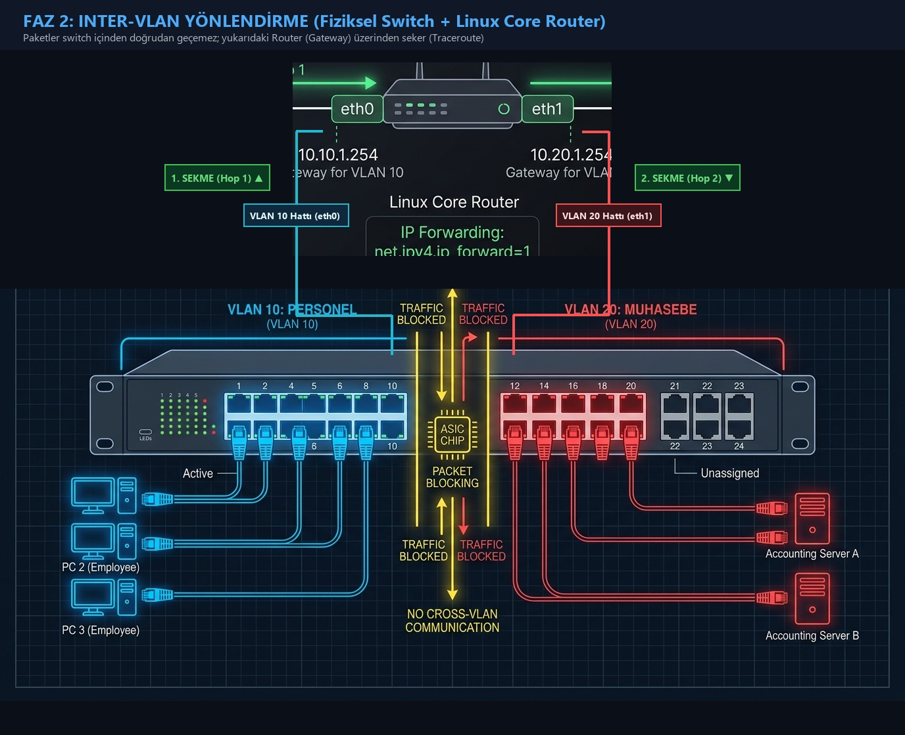
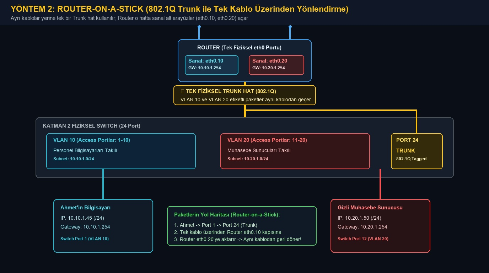
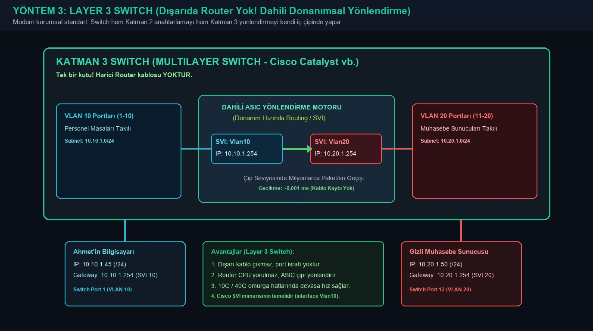

# 🧭 Faz 2: Yönlendirme (Routing), Default Gateway & Inter-VLAN İletişim

Faz 1'de iki farklı alt ağın (`vlan10` ve `vlan20`) birbirinden tamamen izole olduğunu ve doğrudan konuşamadığını gördük. Bu laboratuvarda; araya çift ağ kartına (vNIC) sahip bir **Linux Core Router** yerleştirecek, **IP Yönlendirme (IP Forwarding)** mekanizmasını aktif edecek ve paketlerin ağlar arasında sekerek hedefe nasıl ulaştığını **Traceroute** ile adım adım izleyeceğiz.



---

## 🛣️ Inter-VLAN Yönlendirmenin 3 Yolu: Hangisi Ne Zaman Kullanılır?

Ağ dünyasında iki farklı VLAN'ı (örneğin Personel ile Muhasebe) birbiriyle konuşturmanın 3 farklı yöntemi vardır:

---

### 1. Yöntem: Her VLAN İçin Ayrı Kablo (Geleneksel / Legacy Yöntem)

Yukarıdaki ilk mimari görselinde gördüğünüz yapıdır:
* Switch'in **VLAN 10** bölgesinden bir kablo çıkar $\rightarrow$ Router'ın **`eth0`** portuna takılır (`10.10.1.254`).
* Switch'in **VLAN 20** bölgesinden ayrı bir kablo çıkar $\rightarrow$ Router'ın **`eth1`** portuna takılır (`10.20.1.254`).

#### ❓ Neden Bu Laboratuvarda 1. Yöntemi Kullandık?
1. **Docker ile Mükemmel Eşleşme:** Docker'da `core-router` container'ına `networks:` altında iki ayrı bridge ağı bağladığımızda (`vlan10_personel` ve `vlan20_sunucu`), Linux çekirdeği container içine tam olarak iki ayrı sanal ağ kartı (**`eth0`** ve **`eth1`**) takar.
2. **Pedagojik ve Anlaşılır Olması:** Linux çekirdeğinde `net.ipv4.ip_forward=1` parametresinin sihrini; paketin sol koldan (`eth0`) girip, yönlendirilip sağ koldan (`eth1`) çıktığını komut satırında bizzat görmek en yalın bu yöntemle mümkündür.
3. **Gerçek Hayattaki Sınırı:** Eğer şirkette 30 tane VLAN olsaydı, Router üzerine 30 tane pahalı port ve 30 tane kablo takmanız gerekirdi. Bu yüzden 3-4 VLAN'dan büyük kurumsal ağlarda 2. veya 3. yönteme geçilir.

---

### 2. Yöntem: Router-on-a-Stick (802.1Q Trunk ile Tek Kablo)

Mühendisler 30 tane ayrı kablo çekmek yerine şu yöntemi icat etmiştir:
* Switch ile Router arasına **tek bir adet yüksek hızlı kablo** takılır (**Trunk Hat**).
* Paketler bu tek kablodan geçerken başlarına **4 baytlık küçük etiketler (VLAN Tag: 10 veya 20)** yapıştırılır (IEEE 802.1Q standardı).
* Router üzerindeki o tek fiziksel port yazılımla sanal alt arayüzlere (**Sub-interfaces**) bölünür:
  * `eth0.10` $\rightarrow$ VLAN 10 Gateway (`10.10.1.254`)
  * `eth0.20` $\rightarrow$ VLAN 20 Gateway (`10.20.1.254`)
* Paketler tek bir kablodan tren vagonları gibi gider, yönlendirilir ve aynı kablodan geri döner.



---

### 3. Yöntem: Layer 3 Switch (Dışarıda Router Yok! Dahili SVI Yönlendirmesi)

Modern kurumsal şirketlerin ve veri merkezlerinin standardıdır:
* Masanın üzerine harici bir Router kutusu **konulmaz**; Switch ile Router arasındaki dış kablolar tamamen çöpe atılır!
* Kullanılan anahtar **Layer 3 Switch (Çok Katmanlı Anahtar)**'dır; yani hem Katman 2 anahtarlamayı hem de Katman 3 IP yönlendirmeyi yapabilen akıllı bir cihazdır.
* Switch kendi işletim sistemi içinde her VLAN için sanal bir yönlendirici kapısı açar (**SVI - Switch Virtual Interface**: `interface Vlan10` ve `interface Vlan20`).
* Paketler hiçbir dış kabloya çıkmadan, switch'in kendi içindeki **ASIC işlemci çipinde** saniyede milyonlarca paket hızında donanımsal olarak yönlendirilir!



---

## 📌 Teorik Bağlantı (Ana Rehber)
Bu lab aşağıdaki rehber bölümlerini uygulamaya döker:
* [Modül 1 / Madde 4: Default Gateway (Varsayılan Ağ Geçidi)](../../README.md#4-default-gateway-varsayılan-ağ-geçidi)
* [Modül 4 / Madde 11: VLAN & Inter-VLAN Routing](../../README.md#11-vlan-virtual-local-area-network--trunking)
* [Modül 6: Adım Adım Temel Akış (Departmanlar Arası Geçiş)](../../README.md#3-aşama-departmanlar-arası-geçiş-ve-güvenlik-duvarı-inter-vlan-routing--firewall)

---

## 🏗️ Laboratuvar Mimarisi (Fiziksel Kablo Zinciri & Paket Akışı)

### 🏢 Gerçek Hayat Benzetmesi (İki Ayrı Bina ve Güvenlik Geçiş Kulübesi):
* **A Binası (VLAN 10):** Personelin çalıştığı bina. İçinde kendi kat koridoru (Sanal Switch 1) var.
* **B Binası (VLAN 20):** Muhasebe kasalarının olduğu bina. İçinde kendi kat koridoru (Sanal Switch 2) var.
* **Duvar:** İki bina arasında fiziksel hiçbir doğrudan kapı yoktur! (İzolasyon)
* **Güvenlik Kulübesi (Core Router):** İki binanın tam ortasına konulmuştur:
  * **1. Kapısı (`eth0`):** A Binasının koridoruna açılır (`10.10.1.254`).
  * **2. Kapısı (`eth1`):** B Binasının koridoruna açılır (`10.20.1.254`).
  * Memur (**`ip_forward=1`**), mektubu 1. kapıdan alıp masanın üzerinden 2. kapıya uzatır!

```text
  [ 💻 AHMET'İN BİLGİSAYARI ] (IP: 10.10.1.45)
             │
             │ (1. Sanal Kablo: Ahmet'in bilgisayarından çıkar)
             ▼
  ┌────────────────────────────────────────────────────────┐
  │   vlan10_personel KÖPRÜSÜ (1. Sanal Switch)            │
  │   (Personel Odasının Ortak Switch Kutusu)              │
  └──────────────────────────┬─────────────────────────────┘
                             │
                             │ (2. Sanal Kablo: Switch'ten Router'a gider)
                             ▼
  ┌────────────────────────────────────────────────────────┐
  │                   CORE-ROUTER                          │
  │            (İki Kapılı Yönlendirici Kutu)              │
  │                                                        │
  │   🚪 eth0 Kapısı: 10.10.1.254 (VLAN 10 Ağ Geçidi)      │
  │          │                                             │
  │          │ ⚡ Çekirdek Yönlendirme (net.ipv4.ip_forward=1)│
  │          ▼                                             │
  │   🚪 eth1 Kapısı: 10.20.1.254 (VLAN 20 Ağ Geçidi)      │
  └──────────────────────────┬─────────────────────────────┘
                             │
                             │ (3. Sanal Kablo: Router'dan 2. Switch'e gider)
                             ▼
  ┌────────────────────────────────────────────────────────┐
  │   vlan20_sunucu KÖPRÜSÜ (2. Sanal Switch)              │
  │   (Muhasebe Odasının Ortak Switch Kutusu)              │
  └──────────────────────────┬─────────────────────────────┘
                             │
                             │ (4. Sanal Kablo: Switch'ten Muhasebeye gider)
                             ▼
  [ 🖥️ GİZLİ MUHASEBE SUNUCUSU ] (IP: 10.20.1.50)
```

### 📦 Bir Paketin Adım Adım Yolculuğu (1 ➔ 2 ➔ 3 ➔ 4):
1. **Ahmet (`10.10.1.45`)** paketi gönderir $\rightarrow$ Paket **1. kabloyla** `vlan10` switch'ine girer.
2. `vlan10` switch'i bakar: *"Bu paket muhasebeye gidecek ama o benim odamda değil, çıkış kapısına yollayayım"* der ve **2. kabloyla** paketi Router'ın **`eth0` (`10.10.1.254`)** kapısına atar.
3. **Core Router** paketi inceler: *"Hedef 10.20.1.50, bu benim diğer kapım olan `eth1` tarafında!"* der ve paketi kendi içinden geçirir (**`net.ipv4.ip_forward=1`**).
4. Paket **3. kabloyla** Router'ın **`eth1`** kapısından çıkarak `vlan20` switch'ine basılır.
5. `vlan20` switch'i de paketi **4. kabloyla** hedef olan **Gizli Muhasebe Sunucusuna (`10.20.1.50`)** teslim eder!

---

## 🚀 Laboratuvarı Başlatma

Terminalinizi bu klasörde (`labs/phase-02-routing-and-gateway`) açın ve container'ları ayağa kaldırın:

```bash
docker compose up -d
```

---

## 🔍 Adım Adım İnceleme ve Deneyler

### 1. Adım: Router'ın Çift Ağ Kartını ve Yönlendirme Tablosunu İnceleme
Core Router her iki ağa da fiziksel olarak bağlıdır. Arayüzlerine bakalım:

```bash
docker exec -it core-router ip -c a
```

* `eth0`: `10.10.1.254/24` (Ahmet'in ağındaki bacağı)
* `eth1`: `10.20.1.254/24` (Muhasebe ağındaki bacağı)

Şimdi Router'ın çekirdeğindeki **IP İleri Taşıma (IP Forwarding)** bayrağının açık olduğunu doğrulayalım:

```bash
docker exec -it core-router cat /proc/sys/net/ipv4/ip_forward
```
*(Sonuç `1` olmalıdır. Bu, Linux çekirdeğine "Gelen paket sana ait değilse bile atma, diğer arayüzden hedefe fırlat" emrini verir).*

---

### 2. Adım: İstemcilere Ağ Geçidi (Route) Tanımlama
Ahmet'in bilgisayarı henüz `10.20.1.0/24` ağına gitmek için kime başvuracağını bilmez. Ahmet'in rotasını inceleyelim:

```bash
docker exec -it ahmet-pc ip route show
```

Şimdi Ahmet'e şu kuralı söyleyelim:  
*"Eğer `10.20.1.0/24` (Sunucu) ağına bir paket göndermek istersen, bunu kapıdaki Core Router'a (`10.10.1.254`) teslim et!"*

```bash
docker exec -it ahmet-pc ip route add 10.20.1.0/24 via 10.10.1.254
```

Aynı şekilde yanıt paketinin Ahmet'e dönebilmesi için muhasebe sunucusuna da dönüş yolunu ekleyelim:
```bash
docker exec -it gizli-muhasebe ip route add 10.10.1.0/24 via 10.20.1.254
```

---

### 3. Adım: Canlı Ping Testi (Duvar Yıkıldı!)
Şimdi Ahmet tekrar muhasebe sunucusuna ping atsın:

```bash
docker exec -it ahmet-pc ping -c 3 10.20.1.50
```

#### 📋 Sonuç:
```text
64 bytes from 10.20.1.50: seq=1 ttl=63 time=0.124 ms
64 bytes from 10.20.1.50: seq=2 ttl=63 time=0.089 ms
```
🎉 **Başarılı!** Paketler artık iki farklı mahalle arasında sorunsuzca akmaktadır!  
*(Dikkat: `ttl=63` oldu! Normalde TTL 64 başlar; Router üzerinden geçtiği için 1 azaldı).*

---

### 4. Adım: Paketlerin Yolunu İzleme (Traceroute)
Paketin router üzerinden sektiğini kendi gözlerimizle görelim:

```bash
docker exec -it ahmet-pc traceroute -n 10.20.1.50
```

#### 📋 Örnek Çıktı:
```text
traceroute to 10.20.1.50 (10.20.1.50), 30 hops max, 46 byte packets
 1  10.10.1.254  0.021 ms  0.012 ms  0.011 ms   <--- 1. Sekme: CORE ROUTER
 2  10.20.1.50   0.034 ms  0.027 ms  0.021 ms   <--- 2. Sekme: HEDEF SUNUCU
```

---

### 5. Adım: "Kabloyu Kesmek" — Yönlendirmeyi Kapatma Deneyi

Bir yönlendiricinin trafiği nasıl kestiğini canlı görmek için iki farklı yöntem kullanabilirsiniz:

#### 🛡️ Yöntem A: Firewall Kuralları ile Trafiği Kesmek (`iptables` - Önerilen)
Gerçek hayatta güvenlik duvarları paket iletimini böyle keser. Hiçbir ayar değiştirmeden doğrudan çalıştırabilirsiniz:

```bash
# 1. Yönlendirmeyi engelle (Tüm geçiş trafiğini çöpe at):
docker exec -it core-router iptables -P FORWARD DROP
```

Şimdi Ahmet tekrar ping atsın:
```bash
docker exec -it ahmet-pc ping -c 2 -W 2 10.20.1.50
```
*(Paketler anında düşer ve `%100 packet loss` olur!)*

Tekrar izin vermek için:
```bash
docker exec -it core-router iptables -P FORWARD ACCEPT
```
*(Ping anında tekrar kesintisiz akmaya başlar!)*

---

#### ⚙️ Yöntem B: Çekirdek Seviyesinde IP Forwarding Kapatmak (`sysctl`)
> ⚠️ **`Read-only file system` Hatası Neden Alınır?**  
> Docker güvenlik gerekçesiyle container'ların ana makinenin Linux çekirdek parametrelerini değiştirmesini engellemek için `/proc/sys` dizinini varsayılan olarak **salt okunur (Read-only)** bağlar.  
> Bu komutun çalışabilmesi için `docker-compose.yml` içindeki `core-router` servisine `privileged: true` yetkisi eklenmiştir.

Container'ı güncel yetkiyle başlatmak için:
```bash
docker compose up -d
```

Ardından çekirdek parametresini anlık olarak kapatıp açabilirsiniz:
```bash
# Kapat:
docker exec -it core-router sysctl -w net.ipv4.ip_forward=0

# Aç:
docker exec -it core-router sysctl -w net.ipv4.ip_forward=1
```

---

## 🧹 Laboratuvarı Kapatma ve Temizlik

```bash
docker compose down
```

---

## 🎯 Bu Fazda Ne Öğrendik?
1. **Default Gateway / Route** olmadan cihazların kendi alt ağları dışındaki hedeflere paket ulaştıramayacağını,
2. Çoklu arayüze sahip bir cihazın işletim sistemi çekirdeğindeki **`ip_forward`** mekanizmasıyla nasıl tam teşekküllü bir yönlendiriciye (Router) dönüştüğünü,
3. **Traceroute** ile paketin ağ geçitlerinden geçerken TTL değerinin düşüşünü ve sekmelerini adım adım izlemeyi.

Sıradaki laboratuvarımız: [**Faz 3: Docker NAT ve Port Eşleme (DNAT / SNAT)**](../phase-03-nat-and-port-mapping/)! 🚀
